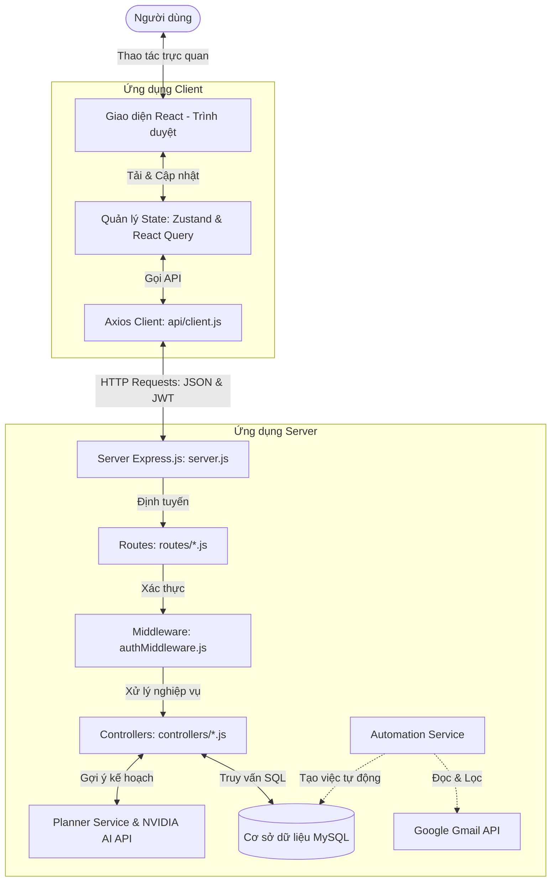
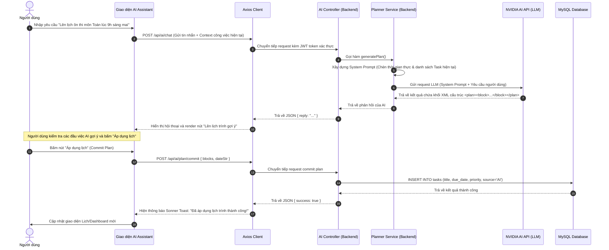

# Hướng Dẫn Luồng Hoạt Động & Bản Đồ Đọc Code
## Dự Án Lập Lịch Cá Nhân (Personal Calendar & Tasks Planner)

Tài liệu này cung cấp sơ đồ luồng hoạt động hoàn chỉnh của hệ thống (đã đồng nhất sự kiện và công việc thành **Task**) bằng biểu đồ Mermaid, đồng thời hướng dẫn chi tiết cách đọc mã nguồn từ ngoài vào trong, từ Frontend vào Backend theo từng bước cụ thể.

---

## I. TỔNG QUAN HỆ THỐNG & TÍNH NĂNG CHÍNH

Hệ thống được thiết kế theo cấu trúc **Client-Server độc lập**:
- **Frontend (Client)**: Viết bằng React, sử dụng Vite làm môi trường chạy thử và đóng gói. Giao diện được thiết kế theo phong cách Dark Mode/Glassmorphism hiện đại với thư viện Tailwind CSS và Lucide Icons.
- **Backend (Server API)**: Viết bằng Node.js / Express, lưu trữ dữ liệu trong MySQL. Đồng thời tích hợp trợ lý ảo AI qua API tương thích OpenAI (NVIDIA AI) và hệ thống tự động quét email để tạo công việc tự động.

### Các Tính Năng Cốt Lõi:
1. **Quản lý Công việc Đồng nhất (Unified Tasks)**: Loại bỏ hoàn toàn sự phân tách giữa "Sự kiện" và "Công việc". Tất cả lịch trình, kế hoạch là các thực thể **Task** có thể cấu hình hạn chót (`due_date` và giờ cụ thể) cùng độ ưu tiên (1, 2, 3) và danh mục màu sắc.
2. **Trang Lịch Bản địa (Calendar Page)**: Hỗ trợ hiển thị song song Lịch Dương và Lịch Âm (Lịch Việt Nam) với các nhãn ngày lễ chính thức và ngày đặc biệt (mùng 1, rằm). Hiển thị trực tiếp danh sách công việc trên từng ô ngày và cho phép tích chọn hoàn thành nhanh.
3. **Bảng Điều khiển Tổng hợp (Dashboard Page)**: Gom toàn bộ đầu việc của ngày hôm nay, việc quá hạn, việc hoàn thành, thông báo từ hệ thống và biểu đồ thống kê trực quan.
4. **Trợ lý Ảo AI (AI Assistant Planner)**: Cho phép trò chuyện tự nhiên với AI. AI có khả năng đề xuất lập kế hoạch và sinh mã cấu trúc `<plan>`. Người dùng có thể nhấn nút "Áp dụng lịch" để tự động lưu các đầu việc do AI gợi ý vào cơ sở dữ liệu.
5. **Dịch vụ Tự động hóa**: Tự động lọc hòm thư email để tạo việc tự động và gửi thông báo nhắc việc.

---

## II. SƠ ĐỒ LUỒNG HOẠT ĐỘNG (SYSTEM FLOWS)

### 1. Luồng Kiến Trúc Tổng Thể (System Architecture Flow)



---

### 2. Luồng Tương Tác Của Trợ Lý AI (AI Chat & Commit Plan Flow)

Sơ đồ trình bày cách tin nhắn văn bản của người dùng được gửi lên AI để trả về một kế hoạch, sau đó lưu trực tiếp vào cơ sở dữ liệu khi người dùng đồng ý:



---

## III. BẢN ĐỒ ĐỌC MÃ NGUỒN (STEP-BY-STEP CODE READING MAP)

Để hiểu rõ cách viết và vận hành của hệ thống này, bạn nên đọc code theo thứ tự từ ngoài vào trong dưới đây:

### BƯỚC 1: Tìm hiểu luồng Khởi tạo và Định tuyến Frontend
Đọc theo thứ tự để biết giao diện được tải lên trình duyệt và điều hướng trang như thế nào:
1. [frontend/index.html](file:///Users/mong/Documents/FrontEnd/personal-calendar/frontend/index.html): File HTML gốc, nơi khai báo thẻ `<div id="root">` làm điểm neo cho React.
2. [frontend/src/main.jsx](file:///Users/mong/Documents/FrontEnd/personal-calendar/frontend/src/main.jsx): Điểm khởi chạy JavaScript phía Client. Tại đây, React sẽ render ứng dụng vào thẻ `#root` và bọc ứng dụng trong các Provider toàn cục như `QueryClientProvider` (quản lý bộ nhớ đệm dữ liệu) và `BrowserRouter` (quản lý URL trình duyệt).
3. [frontend/src/App.jsx](file:///Users/mong/Documents/FrontEnd/personal-calendar/frontend/src/App.jsx): Component gốc của React, gọi thẳng đến bộ định tuyến router chính.
4. [frontend/src/routes/AppRouter.jsx](file:///Users/mong/Documents/FrontEnd/personal-calendar/frontend/src/routes/AppRouter.jsx): Nơi định nghĩa các tuyến đường dẫn (Route).
   - Tuyến đường công khai: `/login` (Đăng nhập), `/register` (Đăng ký).
   - Tuyến đường bảo mật (Yêu cầu đăng nhập - `ProtectedRoute`): `/dashboard`, `/calendar`, `/tasks`, `/assistant`.
   - Layout chung của trang chứa thanh Sidebar điều hướng nằm ở component `MainLayout`.

### BƯỚC 2: Đọc các trang Giao diện và các Component chức năng (UI Layer)
Khi người dùng truy cập một đường dẫn, React sẽ tải trang tương ứng. Đọc 4 trang chính sau:
1. [frontend/src/pages/DashboardPage.jsx](file:///Users/mong/Documents/FrontEnd/personal-calendar/frontend/src/pages/DashboardPage.jsx): Trang tổng quan.
   - Sử dụng `useQuery` để fetch danh sách công việc.
   - Sắp xếp và lọc các công việc thuộc ngày hôm nay để hiển thị trong mục "Lịch trình hôm nay".
   - Tích hợp nút tích hoàn thành nhanh công việc.
2. [frontend/src/pages/CalendarPage.jsx](file:///Users/mong/Documents/FrontEnd/personal-calendar/frontend/src/pages/CalendarPage.jsx): Trang lịch.
   - Sử dụng thuật toán chia lưới ô ngày trong tháng (42 ngày).
   - Gọi hàm [lunarUtils.js](file:///Users/mong/Documents/FrontEnd/personal-calendar/frontend/src/lib/lunarUtils.js) để chuyển đổi ngày Dương lịch sang ngày Âm lịch bản địa và hiển thị ngày lễ.
   - Lọc danh sách `tasks` có hạn chót trùng với từng ô ngày để hiển thị danh sách công việc nhỏ gọn bên dưới.
3. [frontend/src/pages/TasksPage.jsx](file:///Users/mong/Documents/FrontEnd/personal-calendar/frontend/src/pages/TasksPage.jsx): Trang quản lý công việc chi tiết. Cho phép lọc công việc theo các tab: Hôm nay, Sắp tới, Tất cả, Đã xong; lọc theo nguồn (Email, Zalo, Discord, Custom) và đổi mức độ ưu tiên trực tiếp.
4. [frontend/src/pages/AIAssistant.jsx](file:///Users/mong/Documents/FrontEnd/personal-calendar/frontend/src/pages/AIAssistant.jsx): Trang Trợ lý ảo AI.
   - Chứa khung chat gửi nhận tin nhắn.
   - Sử dụng [MessageList.jsx](file:///Users/mong/Documents/FrontEnd/personal-calendar/frontend/src/components/assistant/MessageList.jsx) để hiển thị danh sách tin nhắn. Nếu tin nhắn từ AI có chứa kế hoạch dạng XML, nó sẽ render khung đề xuất công việc với nút "Áp dụng lịch" tương tác trực tiếp.

### BƯỚC 3: Đọc lớp Kết nối API và Lưu trữ State ở Frontend
1. [frontend/src/stores/authStore.js](file:///Users/mong/Documents/FrontEnd/personal-calendar/frontend/src/stores/authStore.js) & [uiStore.js](file:///Users/mong/Documents/FrontEnd/personal-calendar/frontend/src/stores/uiStore.js): Các store quản lý trạng thái bằng Zustand. `authStore` lưu trữ token đăng nhập và thông tin người dùng. `uiStore` quản lý trạng thái đóng/mở Sidebar và hiển thị các Modal tạo công việc/danh mục.
2. [frontend/src/api/client.js](file:///Users/mong/Documents/FrontEnd/personal-calendar/frontend/src/api/client.js): Cấu hình Axios Client. Tự động đính kèm Token JWT lưu từ localStorage vào header `Authorization: Bearer <token>` của mỗi request gửi lên Backend.
3. [frontend/src/api/index.js](file:///Users/mong/Documents/FrontEnd/personal-calendar/frontend/src/api/index.js): Khai báo và xuất (export) các API client phục vụ cho từng thực thể (ví dụ: `tasksApi` gọi các hàm GET, POST, PUT, DELETE tới backend `/api/tasks`).

### BƯỚC 4: Đọc luồng Tiếp nhận và Định tuyến Backend (Backend Entry Layer)
Khi Axios gửi một request HTTP, backend sẽ đón nhận:
1. [backend/src/server.js](file:///Users/mong/Documents/FrontEnd/personal-calendar/backend/src/server.js): Điểm khởi chạy của Backend Server. Khởi tạo Express, cài đặt các middleware như CORS, đọc JSON body, đăng ký các nhóm đường dẫn API (`/api/auth`, `/api/tasks`, `/api/ai`, `/api/notifications`) và lắng nghe cổng port 5001.
2. [backend/src/middleware/authMiddleware.js](file:///Users/mong/Documents/FrontEnd/personal-calendar/backend/src/middleware/authMiddleware.js): Middleware bảo mật. Mọi request gửi lên các route cần bảo mật bắt buộc phải đi qua đây để giải mã JWT Token. Nếu hợp lệ, nó sẽ gán thông tin user vào `req.user` để các hàm controller phía sau sử dụng.
3. [backend/src/routes/taskRoutes.js](file:///Users/mong/Documents/FrontEnd/personal-calendar/backend/src/routes/taskRoutes.js): Khai báo các endpoint nhỏ cho thực thể task và ánh xạ chúng tới các hàm tương ứng của `taskController` (ví dụ: `GET /` ánh xạ tới `taskController.getTasks`).

### BƯỚC 5: Đọc lớp Xử lý Logic và Tương tác Database trên Backend (Business & DB Layer)
1. [backend/src/controllers/taskController.js](file:///Users/mong/Documents/FrontEnd/personal-calendar/backend/src/controllers/taskController.js): Xử lý toàn bộ logic nghiệp vụ CRUD của công việc (Task).
   - Ví dụ hàm `getTasks` sẽ chạy câu lệnh SQL: `SELECT * FROM tasks WHERE user_id = ?`.
   - Hàm `updateTask` xử lý cập nhật từng phần (partial updates) hỗ trợ cả việc hoàn thành công việc hoặc đổi thời hạn.
2. [backend/src/controllers/aiController.js](file:///Users/mong/Documents/FrontEnd/personal-calendar/backend/src/controllers/aiController.js): Đón nhận request chat từ AI Assistant. Gọi sang tầng dịch vụ AI để xử lý.
3. [backend/src/services/ai/plannerService.js](file:///Users/mong/Documents/FrontEnd/personal-calendar/backend/src/services/ai/plannerService.js): Dịch vụ chính tương tác với LLM.
   - Tạo cấu trúc prompt đặc biệt để ép AI phản hồi theo định dạng XML.
   - Gửi yêu cầu tới NVIDIA LLM API và bóc tách dữ liệu phản hồi.
4. [backend/src/config/db.js](file:///Users/mong/Documents/FrontEnd/personal-calendar/backend/src/config/db.js): Quản lý kết nối hồ chứa (Connection Pool) tới MySQL bằng thư viện `mysql2/promise`.

---

## IV. BẢN ĐỒ TỔNG KẾT LUỒNG DỮ LIỆU (TỪ FRONTEND ĐẾN DATABASE)

Hãy xem ví dụ luồng thực thi khi bạn **Tích chọn hoàn thành công việc trên trang Lịch**:

```txt
[CalendarPage.jsx]
  1. Người dùng bấm chọn ô checkbox của công việc
  2. Kích hoạt `toggleTaskMutation.mutate(task)`
        ↓
[frontend/src/api/index.js]
  3. Gọi hàm `tasksApi.update(id, { status: 'done' })`
        ↓
[frontend/src/api/client.js]
  4. Gửi HTTP PUT Request kèm JWT token trong Header đến: http://localhost:5001/api/tasks/:id
        ↓
[backend/src/server.js]
  5. Express tiếp nhận request và chuyển hướng tới `taskRoutes.js`
        ↓
[backend/src/middleware/authMiddleware.js]
  6. Kiểm tra token hợp lệ, gán `req.user.id = user_id`, cho phép đi tiếp
        ↓
[backend/src/controllers/taskController.js]
  7. Hàm `updateTask` tiếp nhận request.
  8. Thực thi câu lệnh SQL:
     UPDATE tasks SET status = 'done' WHERE id = :id AND user_id = :user_id
        ↓
[MySQL Database]
  9. MySQL cập nhật dòng bản ghi trong bảng `tasks`
        ↓
[Backend Trả Về Phản Hồi]
 10. Trả về JSON { message: "Cập nhật công việc thành công" } với HTTP Status 200
        ↓
[React Query ở Frontend]
 11. Nhận phản hồi thành công, kích hoạt `queryClient.invalidateQueries(['tasks'])`
 12. Tự động fetch lại danh sách task mới và render lại trang Lịch với dấu gạch ngang hoàn thành.
```

Tài liệu này sẽ giúp bạn nhanh chóng làm quen và làm chủ cấu trúc luồng của toàn bộ dự án này một cách có hệ thống!
