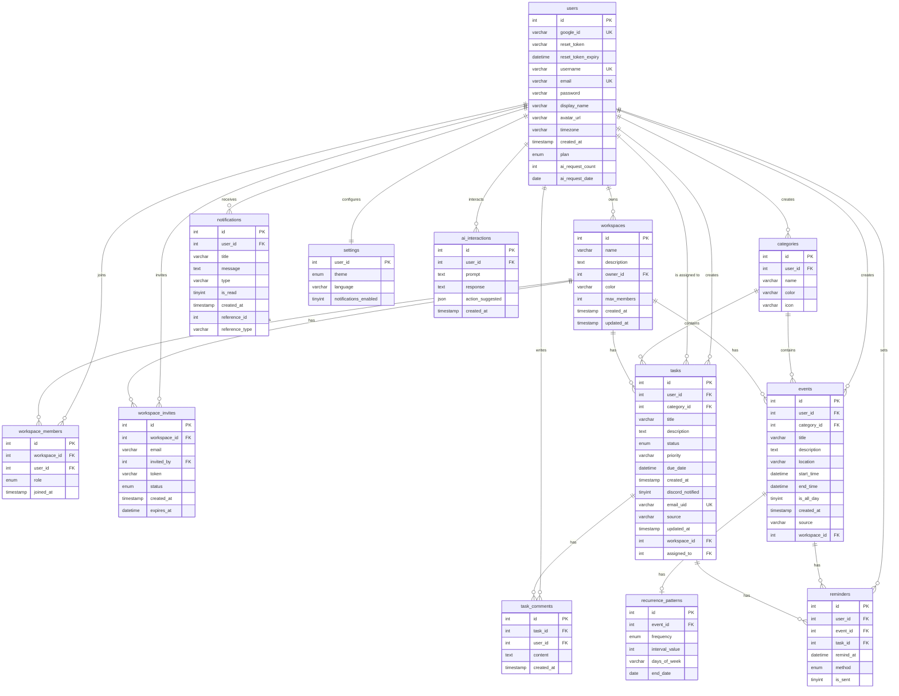

# Cấu trúc Cơ sở dữ liệu (Database Schema)

Dưới đây là sơ đồ thực thể kết nối (ER Diagram) mô tả toàn bộ cấu trúc các bảng và mối quan hệ trong cơ sở dữ liệu của hệ thống FocusFlow, bao gồm cả các chức năng cá nhân (Tasks, Events, Categories), người dùng (Users, Settings, Notifications, AI) và tính năng nhóm (Workspaces, Members, Invites, Task Comments).

