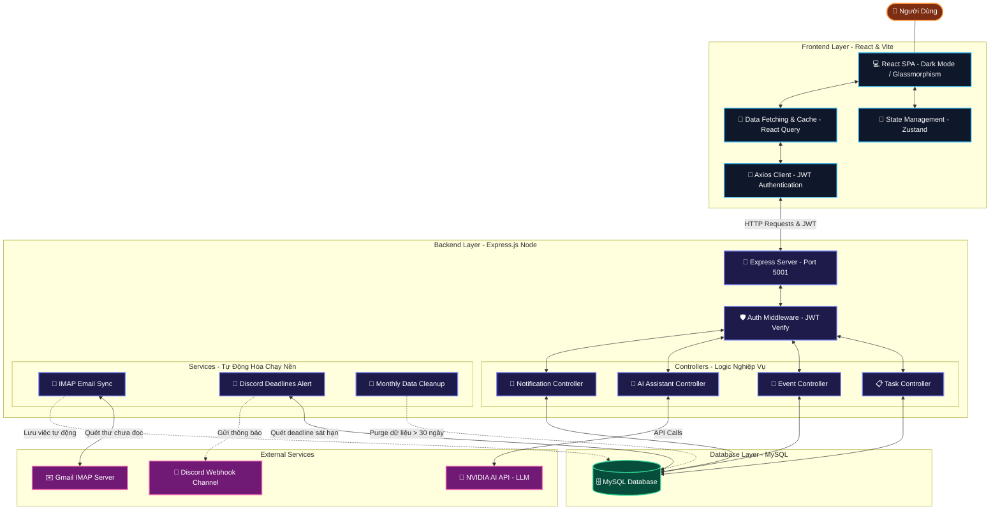
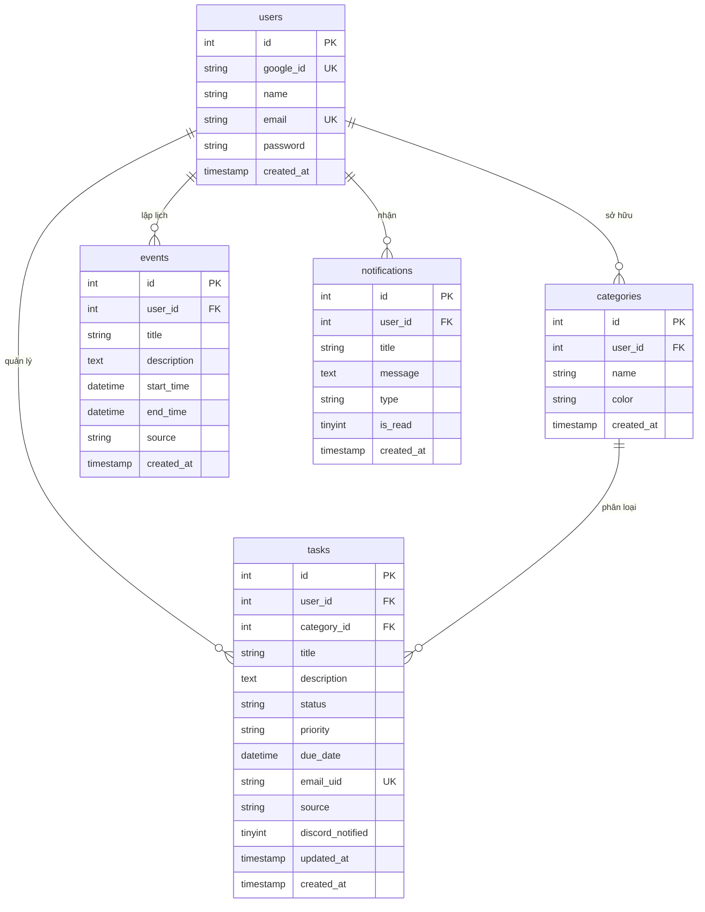

# 🏛️ Kiến Trúc Tổng Quan Hệ Thống (System Architecture)

Hệ thống **Personal Calendar & Tasks Planner** được xây dựng theo kiến trúc **Client-Server (3-Tier Architecture)** decoupled (tách rời độc lập), cho phép mở rộng dễ dàng và vận hành độc lập. Hệ thống kết hợp quản lý lịch trình bản địa, tự động hóa nền (Background Automation), và tích hợp Trí tuệ Nhân tạo (NVIDIA LLM API) để trích xuất và tối ưu hóa thời gian biểu của người dùng.

---

## I. Sơ Đồ Kiến Trúc Tổng Thể (System Architecture Diagram)

Biểu đồ dưới đây mô tả cấu trúc phân tầng từ giao diện người dùng (Frontend UI) tới xử lý nghiệp vụ trung gian (Backend API) và lưu trữ dữ liệu (MySQL DB), kèm theo các dịch vụ tự động hóa và tích hợp AI.



---

## II. Ngăn Xếp Công Nghệ (Technology Stack)

| Phân tầng (Layer) | Công nghệ chính | Vai trò / Lý do lựa chọn |
| :--- | :--- | :--- |
| **Frontend UI** | React + Vite | Tốc độ tải trang siêu tốc (Vite HMR), cấu trúc SPA mượt mà. |
| **Styling (CSS)** | Tailwind CSS + Lucide Icons | Xây dựng giao diện Glassmorphism và Dark Mode hiện đại, nhất quán. |
| **State Management**| Zustand | Lưu trữ thông tin đăng nhập và trạng thái UI cực kỳ gọn nhẹ. |
| **Data Fetching** | React Query (TanStack) | Tự động cache dữ liệu, tối ưu hóa băng thông, đồng bộ realtime. |
| **Backend Server** | Node.js + Express.js | Xử lý bất đồng bộ I/O cực tốt cho đồng thời API và Worker chạy nền. |
| **Cơ sở dữ liệu** | MySQL | Quản lý quan hệ chặt chẽ giữa User, Task, Event và Categories. |
| **Tự động hóa** | Node IMAP & Webhook | Kết nối mail server và gửi thông báo Discord tự động không tốn chi phí. |
| **Trí tuệ nhân tạo** | NVIDIA API (LLM) | Mô hình xử lý ngôn ngữ tự nhiên tối ưu giúp tự động lập lịch biểu. |

---

## III. Cấu Trúc Cơ Sở Dữ Liệu (Database Schema)

Cơ sở dữ liệu bao gồm 5 bảng chính, có liên kết khóa ngoại chặt chẽ để quản lý quyền sở hữu dữ liệu theo từng người dùng.



---

## IV. Sơ Đồ Ánh Xạ Thư Mục Code (Codebase Directory Mapping)

Để đọc hiểu và bảo trì hệ thống hiệu quả, dưới đây là sơ đồ định vị các thành phần cốt lõi:

```text
├── docs/                      # Tài liệu chi tiết các phân hệ hệ thống (Mermaid & Markdown)
│   ├── ARCHITECTURE.md        # [File này] Tổng quan kiến trúc & CSDL
│   ├── CALENDAR_SYSTEM.md     # Hệ thống Lịch Dương/Lịch Âm & Ngày lễ
│   ├── TASK_MANAGEMENT.md     # Quản lý & Lọc công việc thông minh
│   ├── AI_ASSISTANT.md        # Trợ lý ảo AI & Cơ chế lập lịch tự động
│   └── AUTOMATION_SYSTEM.md   # Quét Email IMAP, Nhắc Discord & Dọn dẹp dữ liệu
│
├── frontend/                  # Mã nguồn ứng dụng Giao diện (Client)
│   ├── index.html             # Điểm neo HTML chính cho React SPA
│   ├── src/
│   │   ├── main.jsx           # Khởi tạo React & các Provider toàn cục
│   │   ├── App.jsx            # Component gốc
│   │   ├── routes/            # Quản lý định tuyến và bảo mật trang (AppRouter.jsx)
│   │   ├── stores/            # Quản lý State toàn cục bằng Zustand (authStore, uiStore)
│   │   ├── api/               # Lớp kết nối API Axios (client.js, index.js)
│   │   ├── lib/               # Tiện ích bổ sung: Âm lịch (lunarUtils.js), Định dạng (dateFormat.js)
│   │   └── pages/             # Các trang giao diện chính:
│   │       ├── DashboardPage.jsx  # Bảng điều khiển tích hợp
│   │       ├── CalendarPage.jsx   # Trang Lịch đa chức năng (Âm/Dương)
│   │       ├── TasksPage.jsx      # Quản lý & lọc danh sách công việc
│   │       └── AIAssistant.jsx    # Trò chuyện & Áp dụng lịch từ Trợ lý AI
│
└── backend/                   # Mã nguồn máy chủ & Tự động hóa (Server)
    ├── src/
    │   ├── server.js          # Khởi động máy chủ Express & Automations
    │   ├── config/            # Cấu hình Kết nối CSDL & Di cư (db.js, migrate_db.js)
    │   ├── middleware/        # Middleware xác thực bảo mật JWT (authMiddleware.js)
    │   ├── routes/            # Khai báo các Endpoint định tuyến API (taskRoutes.js, eventRoutes.js,...)
    │   ├── controllers/       # Xử lý nghiệp vụ chính (taskController.js, aiController.js,...)
    │   ├── services/          # Các dịch vụ xử lý phức tạp:
    │   │   ├── ai/            # Planner Service giao tiếp LLM & phân tách kế hoạch
    │   │   └── automationService.js # Quét Email IMAP, Nhắc nhở Discord, Dọn dẹp hàng tháng
    │   └── utils/             # Các hàm tiện ích bổ trợ lọc email, thời gian
    └── .env                   # Cấu hình biến môi trường cục bộ (Cổng, Database, Webhook, API keys)
```
