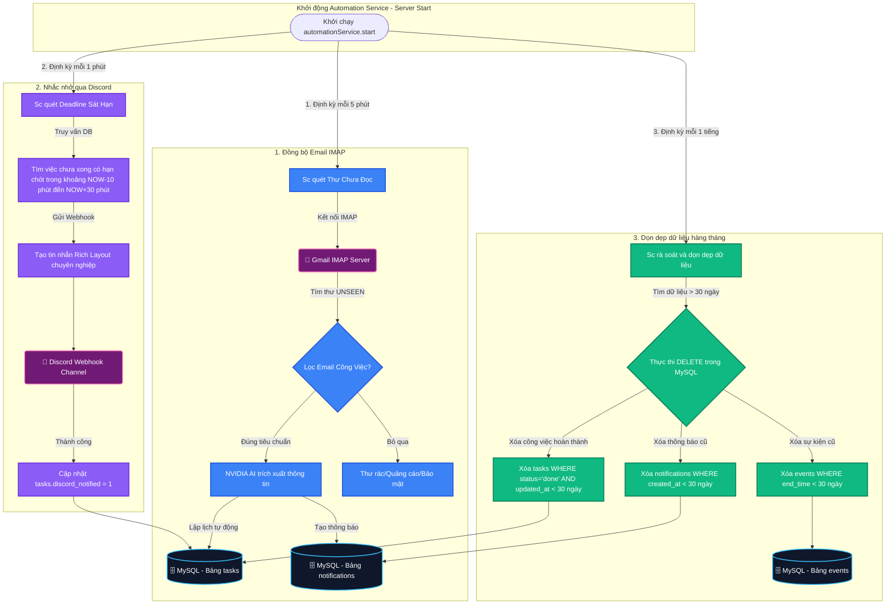

# 🤖 Hệ Thống Tự Động Hóa Chạy Nền (Background Automation System)

Hệ thống **Tự động hóa chạy nền** cung cấp khả năng tự vận hành liên tục cho backend mà không cần sự tương tác trực tiếp của người dùng. Hệ thống tích hợp 3 dịch vụ cốt lõi: tự động quét email để chuyển hóa thành công việc, gửi nhắc nhở công việc sắp đến hạn qua Discord, và thực thi chính sách lưu trữ/dọn dẹp dữ liệu người dùng định kỳ hàng tháng.

---

## I. Vấn Đề Giải Quyết (Problem Solved)

1. **Bỏ sót công việc từ Email**: Người dùng nhận được nhiều email giao việc nhưng thường xuyên quên ghi chép lại vào lịch cá nhân, dẫn đến trễ hạn.
2. **Quên deadline quan trọng**: Người dùng bận rộn không thể liên tục mở ứng dụng để kiểm tra việc cần làm tiếp theo, dẫn đến việc lỡ hạn chót.
3. **Phình to và chậm chạp cơ sở dữ liệu**: Hàng ngàn công việc đã làm xong, sự kiện cũ và thông báo tích tụ qua nhiều tháng làm chậm hiệu năng truy vấn của ứng dụng. Tuy nhiên, nếu xóa quá nhanh (ví dụ: xóa ngay ngày hôm sau) sẽ làm người dùng không thể xem lại lịch trình cũ khi cần thiết.

---

## II. Sơ Đồ Quy Trình Tác Vụ Nền (Background Workers Workflows)

Dưới đây là sơ đồ kiến trúc hoạt động độc lập của 3 luồng tác vụ nền được quản lý tập trung bởi [automationService.js](file:///Users/mong/Documents/FrontEnd/personal-calendar/backend/src/services/automationService.js):

---

## III. Cơ Chế Hoạt Động & Chi Tiết Triển Khai (Technical Details)

### 1. Đồng bộ Email tự động trích xuất bằng AI
* **Quét Hòm thư thông qua giao thức IMAP**: Hệ thống sử dụng thư viện `imap-simple` kết nối bảo mật tới Mail Server (Ví dụ: Gmail IMAP) sử dụng mật khẩu ứng dụng (App Password). Quét định kỳ mỗi 5 phút để tìm kiếm các thư mới chưa đọc (`UNSEEN`).
* **Hộp lọc thư công việc nâng cấp (`emailFilter.js`)**: Để tránh việc tạo các công việc rác từ các email quảng cáo hoặc thông báo bảo mật từ hệ thống (Google, Apple, Facebook,...), hệ thống chạy bộ lọc từ khóa trên Tiêu đề, Người gửi, và Nội dung email:
  - Bỏ qua các thư từ người gửi chứa: `no-reply`, `noreply`, `newsletter`, `promo`, `alert`.
  - Bỏ qua các email liên quan đến bảo mật hoặc tài khoản: `đăng nhập`, `mật mã`, `security`, `verification`, `otp`.
  - Chỉ xử lý các email mang tính chất công việc hoặc giao việc: `yêu cầu`, `lịch họp`, `công việc`, `báo cáo`, `hạn chót`, `khẩn cấp`, `deadline`, `proposal`, `chỉ thị`.
* **Trích xuất thông minh bằng NVIDIA AI**: Nội dung email thô sẽ được gửi tới NVIDIA AI API với một cấu trúc Prompt chuyên dụng để phân tích và trả về đúng một khối JSON chứa: Tiêu đề công việc, Mô tả tóm tắt, Mức độ ưu tiên phù hợp, và Thời hạn hoàn thành (`due_date`).
* **Ghi nhận & Tạo thông báo**: Công việc sau trích xuất được lưu tự động vào MySQL. Đồng thời hệ thống tạo một bản ghi thông báo trong bảng `notifications` giúp người dùng biết được công việc nào vừa được trích xuất tự động từ hòm thư của họ.

### 2. Gửi nhắc nhở thông báo qua Discord Webhook
Để đảm bảo người dùng luôn nhận được nhắc nhở công việc đúng giờ, hệ thống tích hợp dịch vụ kiểm tra mỗi 1 phút:
* **Cơ chế truy vấn an toàn múi giờ (Timezone-safe)**: Để tránh lệch múi giờ giữa máy chủ database và Node.js, backend tự tạo chuỗi thời gian cục bộ (Việt Nam) trong Node.js và truyền dạng tham số:
  - Khởi điểm quét (`tenMinutesAgo`): Lấy từ 10 phút trước hiện tại. Điều này tạo cơ chế "quét bù" cực kỳ an toàn nếu server bị tắt tạm thời trùng khớp thời điểm cần nhắc việc.
  - Hạn chót quét (`in30Minutes`): Lấy tối đa đến 30 phút trong tương lai.
* **Không giới hạn ưu tiên**: Hệ thống quét tất cả các công việc chưa hoàn thành của người dùng sắp đến hạn trong vòng 30 phút tới, không phân biệt độ ưu tiên lớn nhỏ, mang lại sự nhắc nhở tuyệt đối an toàn.
* **Tin nhắn Rich Layout cực kỳ chuyên nghiệp**: Hệ thống tự động biên dịch độ ưu tiên sang các nhãn icon sinh động (`🔴 Cao`, `🟡 Trung bình`, `🟢 Thấp`) và hiển thị định dạng ngày giờ tiếng Việt (`Asia/Ho_Chi_Minh`) gửi trực tiếp qua Discord Webhook để hiển thị đẹp mắt, trực quan nhất cho người dùng.
* **Đánh dấu đã nhắc nhở**: Sau khi gửi webhook thành công, hệ thống cập nhật cột `discord_notified = 1` trong MySQL để tránh việc gửi lặp lại trong các chu kỳ quét sau.

### 3. Chính sách lưu trữ dữ liệu 30 ngày & Tự động dọn dẹp hàng tháng
Để cân bằng hoàn hảo giữa việc lưu trữ lịch trình đầy đủ để người dùng theo dõi hiệu suất và việc dọn dẹp để đảm bảo cơ sở dữ liệu luôn nhẹ nhàng, hoạt động siêu tốc:
* **Thời gian lưu giữ dữ liệu tối thiểu**: **30 ngày (1 tháng)**.
* **Logic dọn dẹp tự động hàng tháng**:
  Hệ thống chạy rà soát định kỳ mỗi tiếng một lần, tự động tìm và xóa vĩnh viễn các dữ liệu đã hết hạn và cũ hơn 30 ngày bao gồm:
  - **Công việc đã xong cũ**: Chỉ xóa các công việc có trạng thái hoàn thành (`status = 'done'`) và đã được cập nhật hoàn thành trước đó **hơn 30 ngày** (`updated_at < NOW() - 30 ngày`). Các công việc chưa hoàn thành hoặc công việc mới hoàn thành trong vòng 1 tháng qua sẽ luôn được bảo toàn tuyệt đối.
  - **Sự kiện lịch cũ**: Tự động dọn dẹp các sự kiện đã kết thúc và diễn ra trước đó **hơn 30 ngày** (`end_time < NOW() - 30 ngày`).
  - **Thông báo cũ**: Tự động dọn dẹp các thông báo cũ đã lưu trữ **hơn 30 ngày** (`created_at < NOW() - 30 ngày`).
* **Trạng thái an toàn**: Dữ liệu lịch trình của người dùng luôn được bảo vệ tối đa, mang lại hiệu năng tối ưu nhất mà không bao giờ bị mất mát dữ liệu hoạt động trong tháng.
