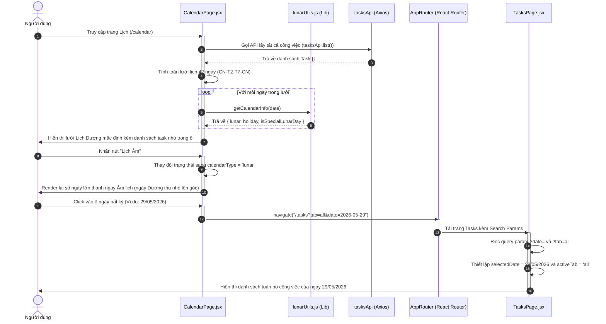

# 📅 Hệ Thống Lịch Bản Địa Đa Năng (Dynamic Calendar System)

Hệ thống **Lịch bản địa đa năng** giải quyết vấn đề quản lý thời gian toàn diện bằng cách hiển thị song song **Lịch Dương (Solar)** và **Lịch Âm (Lunar)** đặc trưng của văn hóa Việt Nam, tích hợp nhận diện tự động các ngày lễ lớn và đồng bộ hóa tương tác thời gian thực với danh sách công việc.

---

## I. Vấn Đề Giải Quyết (Problem Solved)

1. **Thiếu thông tin lịch truyền thống**: Các ứng dụng lịch phương Tây không có Lịch Âm, khiến người dùng khó theo dõi các ngày rằm, mùng 1, Tết cổ truyền, giỗ chạp hoặc các lễ hội truyền thống của Việt Nam.
2. **Quản lý lịch và công việc bị rời rạc**: Người dùng không thể thấy ngay các đầu việc cần làm trong từng ngày cụ thể khi xem tổng quan tháng, gây khó khăn cho việc lên kế hoạch dài hạn.
3. **Phức tạp khi chuyển đổi**: Việc chuyển đổi qua lại giữa giao diện xem Lịch và danh sách công việc thường bị mất bộ lọc ngày, làm đứt gãy trải nghiệm.

---

## II. Sơ Đồ Quy Trình Tương Tác (User-System Interaction Flow)

Dưới đây là sơ đồ tương tác khi người dùng truy cập trang lịch, chuyển đổi chế độ xem Lịch Âm/Dương và click chọn một ngày bất kỳ để xem danh sách công việc cụ thể:



---

## III. Cơ Chế Hoạt Động Chi Tiết (Implementation Details)

### 1. Thuật toán tạo lưới Lịch 6 tuần (42 ngày)
Để đảm bảo giao diện tháng luôn hiển thị đầy đủ và thống nhất trong một khung lưới hình chữ nhật, trang lịch tính toán lưới 6 hàng x 7 cột = 42 ngày:
* **Khởi điểm lưới (`gridStart`)**:
  - Tìm ngày đầu tiên của tháng hiện tại (`startOfMonth`).
  - Xác định thứ của ngày đầu tiên (`dayOfWeek`).
  - Nếu ngày đầu tiên là Thứ 2, lưới bắt đầu đúng ngày đó. Nếu là các ngày khác, lưới sẽ lùi ngược lại để tìm ngày Thứ 2 của tuần trước đó (giúp hiển thị các ngày cuối của tháng trước ở đầu lưới).
  ```javascript
  const startOfMonth = currentDate.startOf('month');
  const dayOfWeek = startOfMonth.day(); // 0 là Chủ nhật, 1 là Thứ hai...
  const diffToMonday = dayOfWeek === 0 ? -6 : 1 - dayOfWeek;
  const gridStart = startOfMonth.add(diffToMonday, 'day').startOf('day');
  ```
* **Tạo mảng ngày**: Chạy vòng lặp 42 lần, mỗi lần cộng thêm 1 ngày từ `gridStart` để lấp đầy lưới lịch.

### 2. Thuật toán Lịch Âm & Nhận diện ngày đặc biệt (`lunarUtils.js`)
Thư viện `lunarUtils.js` tích hợp thuật toán chuyển đổi âm dương thiên văn học phức tạp dành riêng cho múi giờ Việt Nam (`Asia/Ho_Chi_Minh` - GMT+7):
* **Chuyển đổi Dương $\rightarrow$ Âm**: Dựa trên chu kỳ của mặt trăng và các bảng số liệu để trích xuất chính xác ngày âm, tháng âm, và thông báo tháng nhuận (`leap_month`).
* **Đặc tả ngày tâm linh (`isSpecialLunarDay`)**: 
  - Tự động đánh dấu đỏ nổi bật cho ngày **Mùng 1** (khởi đầu) và ngày **Rằm - 15** (trăng tròn) âm lịch mỗi tháng.
* **Nhận diện ngày lễ (`holiday`)**:
  - **Lễ Dương lịch**: Ngày Quốc khánh (2/9), Quốc tế lao động (1/5), Giải phóng miền Nam (30/4), Tết Dương lịch (1/1).
  - **Lễ Âm lịch**: Tết Nguyên Đán (1/1 - 4/1 âm), Giỗ tổ Hùng Vương (10/3 âm), Lễ Vu Lan (15/7 âm), Tết Trung Thu (15/8 âm), Phật Đản (15/4 âm).
  - Gắn nhãn màu đỏ nổi bật đối với các ngày được nghỉ lễ chính thức (`isOff: true`), và màu cam đối với các ngày kỷ niệm truyền thống (`isOff: false`).

### 3. Hiển thị & Hoàn thành nhanh Task ngay trên ô Lịch
* Trong mỗi ô ngày trên lưới lịch, hệ thống thực hiện bộ lọc để tìm các Task có hạn chót (`due_date`) trùng khớp với ngày đó.
* Các Task được render gọn gàng kèm theo giờ thực hiện (nếu có).
* Người dùng có thể trực tiếp click vào **Checkbox** của từng Task ngay trên ô lịch. Hành động này sẽ kích hoạt `toggleTaskMutation` để thực thi cập nhật trạng thái `done` / `todo` lên database thông qua API mà không cần phải rời trang lịch.
* Task đã hoàn thành sẽ hiển thị gạch ngang và mờ đi, mang lại trải nghiệm tương tác trực quan cao.
