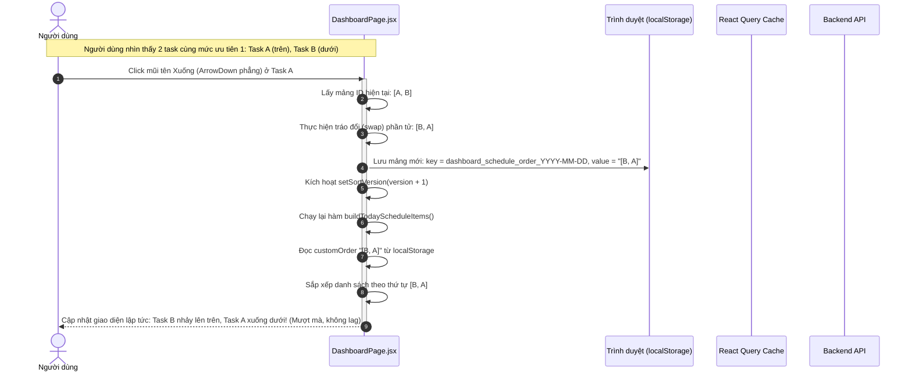
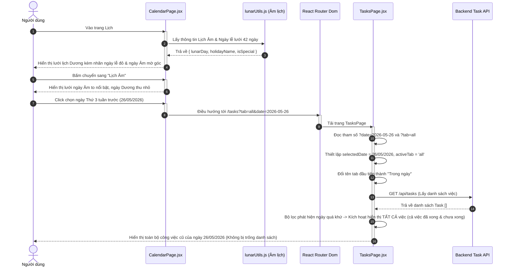
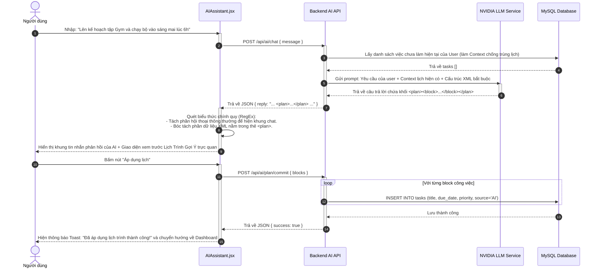
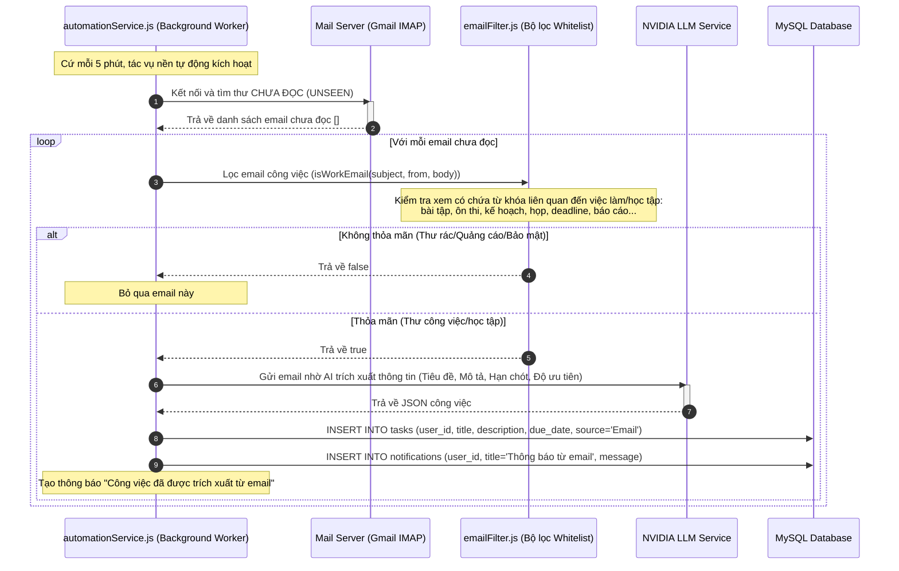

# 🗺️ Bản Đồ Luồng Chức Năng Toàn Hệ Thống (Master Functional Flows)

Tài liệu này mô tả toàn bộ luồng chức năng, sơ đồ tương tác của người dùng và hệ thống điều hướng của trang web **Personal Calendar & Tasks Planner** thông qua các biểu đồ Mermaid trực quan và mô tả chi tiết.

---

## I. Sơ Đồ Điều Hướng & Tính Năng Tổng Thể (Master Navigation & Features Map)

Biểu đồ dưới đây mô tả luồng đi của người dùng khi truy cập trang web, từ giai đoạn Xác thực (Auth), qua Bố cục chính (MainLayout) và tương tác với **5 trang chức năng lõi**:

```mermaid
flowchart TD
    %% Styling
    classDef auth fill:#1e1b4b,stroke:#818cf8,stroke-width:2px,color:#fff;
    classDef layout fill:#0f172a,stroke:#38bdf8,stroke-width:2px,color:#fff;
    classDef page fill:#312e81,stroke:#a5b4fc,stroke-width:2px,color:#fff;
    classDef action fill:#064e3b,stroke:#34d399,stroke-width:2px,color:#fff;
    classDef modal fill:#701a75,stroke:#f472b6,stroke-width:2px,color:#fff;

    %% 1. AUTH LAYER
    Start([👤 Người Dùng Truy Cập]) --> Auth_Check{Đã Đăng Nhập?}
    Auth_Check --> |Chưa| Login_Page[🔑 Trang Đăng Nhập / Login]
    Auth_Check --> |Đã Đăng Nhập| Dashboard_Redirect[➡️ Chuyển Hướng Dashboard]
    
    Login_Page --> |Chưa có tài khoản| Register_Page[📝 Trang Đăng Ký / Register]
    Register_Page --> |Đăng ký thành công| Login_Page
    Login_Page --> |Đăng nhập thành công - Lưu JWT| Main_Layout[🏰 Giao Diện Chung - MainLayout]
    Dashboard_Redirect --> Main_Layout

    %% 2. NAVIGATION & MAIN LAYOUT
    Main_Layout --> |Sidebar Điều Hướng| Router_Switch{Bộ Định Tuyến - Router}

    %% 3. FIVE CORE PAGES
    Router_Switch --> |/dashboard| Page_Dashboard[📊 Bảng Điều Khiển - Dashboard]
    Router_Switch --> |/calendar| Page_Calendar[📅 Trang Lịch - Calendar]
    Router_Switch --> |/tasks| Page_Tasks[📋 Trang Công Việc - Tasks]
    Router_Switch --> |/analytics| Page_Analytics[📈 Trang Phân Tích - Analytics]
    Router_Switch --> |/assistant| Page_AI[🤖 Trợ Lý Ảo AI - AI Assistant]

    %% 4. DASHBOARD INTERACTIONS
    subgraph Dashboard_Features [Tính năng Trang Dashboard]
        Page_Dashboard --> Dash_Stats[🗂️ Thẻ Thống Kê Nhanh]
        Page_Dashboard --> Dash_List[📝 Lịch trình hôm nay]
        Dash_List --> |Di chuyển Lên/Xuống| Reorder_Action[🔀 Sắp xếp thủ công phẳng - localStorage]
        Dash_List --> |Tích hoàn thành| Complete_Action[✅ Đóng việc & gỡ khỏi lịch]
        Dash_List --> |Click nút Maximize| Modal_Schedule[🔎 Popup Lịch trình đầy đủ]
        Modal_Schedule --> |Sắp xếp Lên/Xuống| Reorder_Action
        Page_Dashboard --> Dash_Notif[🔔 Bảng Thông Báo email/Discord gần đây]
    end

    %% 5. CALENDAR INTERACTIONS
    subgraph Calendar_Features [Tính năng Trang Lịch]
        Page_Calendar --> Cal_Toggle[🌗 Nút chuyển đổi Lịch Âm/Lịch Dương]
        Page_Calendar --> Cal_Nav[📅 Chọn Tháng trước/sau & Về hôm nay]
        Page_Calendar --> Cal_Cells[📆 Lưới lịch 42 ngày]
        Cal_Cells --> |Hiển thị| Lunar_Holi[🎏 Ngày Âm lịch bản địa & Nhãn Ngày lễ đỏ]
        Cal_Cells --> |Tương tác| Quick_Complete[✅ Tích hoàn thành nhanh việc trực tiếp trên ô lịch]
        Cal_Cells --> |Click chọn ngày| Tasks_Redirect[➡️ Chuyển hướng TasksPage kèm ?date= YYYY-MM-DD]
    end

    %% 6. TASKS INTERACTIONS
    subgraph Tasks_Features [Tính năng Quản lý Công việc]
        Page_Tasks --> Tasks_Tabs[🗂️ Tab lọc: Hôm nay, Sắp tới, Tất cả, Đã xong]
        Tasks_Tabs --> |Đổi tên động theo ngày chọn| Tab_Labels[🏷️ Nhãn: Hôm nay / Hôm qua / Ngày mai / Trong ngày]
        Page_Tasks --> Tasks_Search[🔍 Tìm kiếm & Lọc theo Nguồn: Email, Zalo, Slack...]
        Page_Tasks --> Tasks_Add[⚡ Thanh ghi nhanh việc cần làm]
        Page_Tasks --> Tasks_Card[📋 Thẻ công việc chi tiết]
        Tasks_Card --> |Lọc ngày mở rộng| Date_Picker[📅 Dropdown lịch trình z-index cao & Listener click ngoài]
        Tasks_Card --> |Đặt giờ tại chỗ| Time_Picker[🕒 Chọn giờ DATETIME]
        Tasks_Card --> |Độ ưu tiên| Priority_Select[🔥 Dropdown mức ưu tiên 1, 2, 3]
        Tasks_Card --> |Sửa tên| Edit_Title[✏️ Sửa tiêu đề tại chỗ inline]
    end

    %% 7. ANALYTICS INTERACTIONS
    subgraph Analytics_Features [Tính năng Trang Phân Tích]
        Page_Analytics --> SVG_Chart[📊 Biểu đồ cột SVG hiệu suất 7 ngày qua]
        SVG_Chart --> |Hover cột| Tooltip_SVG[💬 Tooltip nổi: Tỉ lệ %, Số việc X/Y hoàn thành]
        Page_Analytics --> Performance_Card[💡 Đánh giá trung bình tuần & Lời khuyên động]
        Page_Analytics --> Dist_Cards[📊 Biểu đồ ngang phân bố theo Nguồn & Độ ưu tiên]
    end

    %% 8. AI ASSISTANT INTERACTIONS
    subgraph AI_Features [Tính năng Trợ lý AI]
        Page_AI --> AI_Chat[💬 Khung chat trò chuyện tự nhiên]
        Page_AI --> AI_Suggest[💡 Gợi ý câu hỏi nhanh]
        Page_AI --> AI_Parser[⚙️ Bộ lọc RegEx bóc tách thẻ XML plan]
        AI_Parser --> |Hiển thị| Plan_Preview[📋 Hộp xem trước lịch trình gợi ý]
        Plan_Preview --> |Bấm nút áp dụng| Bulk_Insert[💾 Đồng bộ lưu hàng loạt Task vào MySQL]
    end

    %% Routing connection
    Tasks_Redirect --> Page_Tasks

    %% Apply Classes
    class Login_Page,Register_Page auth;
    class Main_Layout,Router_Switch layout;
    class Page_Dashboard,Page_Calendar,Page_Tasks,Page_Analytics,Page_AI page;
    class Reorder_Action,Complete_Action,Quick_Complete,Tasks_Redirect,Tasks_Add,Bulk_Insert,Edit_Title action;
    class Modal_Schedule,Plan_Preview,Date_Picker,Tooltip_SVG modal;
```

---

## II. Sơ Đồ Quy Trình Tương Tác Chi Tiết Theo Phân Hệ (Detailed Feature Flows)

Dưới đây là sơ đồ tương tác chi tiết từng luồng nghiệp vụ chính của người dùng và hệ thống.

---

### 1. Luồng Sắp Xếp Thủ Công Lịch Trình (Dashboard Task Reordering Flow)

Sơ đồ trình bày cách người dùng thay đổi thứ tự công việc thủ công trên Dashboard bằng nút mũi tên thẳng dài, phẳng không viền bao:

---

### 2. Luồng Điều Hướng Xem Lịch & Lọc Ngày (Calendar Navigation & Query Date Sync Flow)

Luồng tương tác giúp chuyển đổi Lịch Âm/Dương lịch và nhấn chọn ngày trên Calendar để điều hướng đồng bộ sang danh sách Tasks:

---

### 3. Luồng Tương Tác Trợ Lý Ảo AI & Đồng Bộ Lịch (AI Assistant Conversational Flow)

Quy trình người dùng trò chuyện, nhận gợi ý kế hoạch định dạng cấu trúc XML và áp dụng hàng loạt đầu việc vào Database:

---

### 4. Luồng Hoạt Động Của Dịch Vụ Đồng Bộ Email & Thông Báo (IMAP Email Sync Worker Flow)

Tác vụ tự động chạy ngầm trên máy chủ Node.js để lọc email công việc, trích xuất dữ liệu bằng AI và đẩy thông báo cho người dùng:

