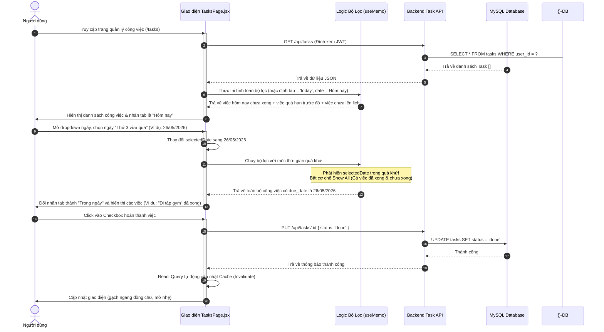

# 📋 Hệ Thống Quản Lý & Lọc Công Việc Thông Minh (Unified Task Management)

Hệ thống **Quản lý công việc đồng nhất** loại bỏ sự chia rẽ phức tạp giữa "Lịch hẹn" và "Danh sách việc cần làm". Bằng cách gộp chung tất cả vào một thực thể duy nhất (**Task**), ứng dụng cung cấp giao diện quản lý đa năng với các bộ lọc thông minh theo nguồn, mức độ ưu tiên và mốc thời gian động.

---

## I. Vấn Đề Giải Quyết (Problem Solved)

1. **Rời rạc giữa Lịch hẹn và Checklist**: Các ứng dụng truyền thống chia việc thành hai trang: Lịch (Calendar Event) và Việc cần làm (Todo List). Người dùng phải nhập hai lần và khó bao quát được những gì cần thực hiện trong ngày.
2. **Hiển thị trống trải khi chọn ngày cũ**: Khi người dùng xem lại lịch trình các ngày cũ, các công việc đã làm xong thường bị ẩn đi (do bộ lọc chỉ hiện việc chưa xong), tạo cảm giác dữ liệu bị dọn dẹp hoặc xóa mất.
3. **Quản lý thời gian kém**: Thiếu các bộ lọc gom nhóm theo nguồn công việc (Email, Zalo, Slack, Discord) và không tự động kéo các công việc đã quá hạn từ hôm trước vào lịch trình hôm nay để nhắc nhở người dùng hoàn thành.

---

## II. Giao Diện Tương Tác Người Dùng (User Interaction Flow)

Sơ đồ trình bày cách người dùng thao tác lọc công việc, tương tác với các tab thông minh và chỉnh sửa thông tin trực tiếp trên từng đầu việc:



---

## III. Cơ Chế Bộ Lọc Thông Minh Theo Thời Gian (Time-Smart Filtering)

Bộ lọc `filteredByTabAndSearch` tại [TasksPage.jsx](file:///Users/mong/Documents/FrontEnd/personal-calendar/frontend/src/pages/TasksPage.jsx) được tối ưu hóa cực kỳ chặt chẽ dựa trên mốc thời gian được chọn so với ngày hiện tại:

```mermaid
flowchart TD
    %% Styling
    classDef start fill:#f43f5e,stroke:#be123c,stroke-width:2px,color:#fff;
    classDef decision fill:#eab308,stroke:#a16207,stroke-width:2px,color:#000;
    classDef process fill:#3b82f6,stroke:#1d4ed8,stroke-width:2px,color:#fff;
    classDef result fill:#10b981,stroke:#047857,stroke-width:2px,color:#fff;

    Start([Nhập danh sách Tasks của User]) --> TabDecision{Tab đang chọn?}

    %% Tab today
    TabDecision --> |activeTab === 'today'| DateDecision{Ngày xem việc là ngày nào?}
    
    DateDecision --> |1. Ngày hiện tại| TodayFilter[Hiển thị:<br/>- Việc có do_date hôm nay<br/>- Việc QUÁ HẠN từ quá khứ (chưa hoàn thành)<br/>- Việc CHƯA LÊN LỊCH]
    DateDecision --> |2. Ngày trong quá khứ| PastFilter[Hiển thị:<br/>- TẤT CẢ việc đã lên lịch vào ngày đó<br/>- Bao gồm cả đã hoàn thành và chưa hoàn thành<br/>* Mục đích: Cho phép xem lại lịch sử lịch trình mà không sợ trống màn hình]
    DateDecision --> |3. Ngày trong tương lai| FutureFilter[Hiển thị:<br/>- Chỉ các việc CẦN LÀM (chưa hoàn thành) của ngày đó]

    %% Các tab khác
    TabDecision --> |activeTab === 'upcoming'| UpcomingFilter[Chỉ hiển thị việc CHƯA HOÀN THÀNH trùng ngày xem]
    TabDecision --> |activeTab === 'completed'| CompletedFilter[Chỉ hiển thị việc ĐÃ HOÀN THÀNH trùng ngày xem]
    TabDecision --> |activeTab === 'all'| AllFilter[Hiển thị TẤT CẢ việc trùng ngày xem + việc chưa lên lịch]

    %% Kết nối kết quả
    TodayFilter --> Output([Danh sách công việc sau lọc & sắp xếp theo giờ])
    PastFilter --> Output
    FutureFilter --> Output
    UpcomingFilter --> Output
    CompletedFilter --> Output
    AllFilter --> Output

    %% Apply Classes
    class Start start;
    class TabDecision,DateDecision decision;
    class TodayFilter,PastFilter,FutureFilter,UpcomingFilter,CompletedFilter,AllFilter process;
    class Output result;
```

---

## IV. Các Tính Năng Cao Cấp Được Triển Khai

### 1. Đổi tên Tab linh hoạt theo ngữ cảnh thời gian (Context-aware Tab Labels)
Để tạo trải nghiệm mượt mà và tự nhiên nhất cho người dùng, nhãn hiển thị của Tab đầu tiên không bị cố định là "Hôm nay". Nó sẽ tự động thay đổi nhãn của chính mình dựa trên ngày đang được lựa chọn ở thanh lọc ngày:
* **Hôm nay**: Khi xem ngày hiện tại.
* **Hôm qua**: Khi chọn xem ngày của hôm trước (Người dùng có thể dễ dàng kiểm điểm lại các công việc ngày hôm qua).
* **Ngày mai**: Khi chọn xem ngày tiếp theo để chuẩn bị trước.
* **Trong ngày**: Khi chọn bất kỳ một ngày xa hơn nào khác.

### 2. Sửa lỗi click-blocking (Monterey CSS Animation Bug Fix)
Trước đây, ứng dụng gặp lỗi nghiêm trọng: người dùng nhấn vào các nút thứ trong tuần (từ Thứ 2 đến Thứ 5) trên thanh lọc ngày thì hệ thống không có phản hồi.
* **Nguyên nhân**: File giao diện chứa thẻ `<input type="date">` ẩn có class `absolute inset-0 opacity-0` dùng để kích hoạt bộ chọn ngày mở rộng. Do thẻ `<label>` cha của nó thiếu thuộc tính định vị `relative`, vùng bao của ô input ẩn này đã bị tràn ra bao phủ toàn bộ vùng hiển thị của dropdown chứa các nút bấm thứ, khiến mọi cú click chuột của người dùng vào các nút thứ đều bị ô input ẩn này đánh chặn.
* **Giải pháp khắc phục**: Đã thêm thuộc tính `relative` vào thẻ `<label>` cha và điều chỉnh z-index (`relative z-20` cho thanh lọc ngày và `relative z-10` cho thanh lọc nguồn). Đồng thời thiết lập một sự kiện lắng nghe click ngoài vùng dropdown (`mousedown` listener kèm `useRef` kiểm tra `contains()`) để tự động đóng dropdown một cách mượt mà và giải phóng hoàn toàn không gian click cho các thành phần giao diện khác.

### 3. Chỉnh sửa và cập nhật dữ liệu tại chỗ (In-place Editing)
* **Chỉnh sửa tiêu đề**: Người dùng có thể bấm trực tiếp vào biểu tượng chiếc bút kế bên tiêu đề Task để đổi tên trực tiếp, nhấn `Enter` hoặc click nút "Lưu" để lưu ngay, nhấn `ESC` hoặc click nút "Hủy" để khôi phục tiêu đề cũ.
* **Chỉnh sửa ngày và giờ trực tiếp**: Tích hợp các thẻ chọn `<input type="date">` và `<input type="time">` không viền (borderless) ngay dưới thông tin công việc, cho phép người dùng thay đổi hạn chót hoặc giờ giấc thực hiện cực kỳ thuận tiện và nhanh chóng mà không cần mở Modal phức tạp.
