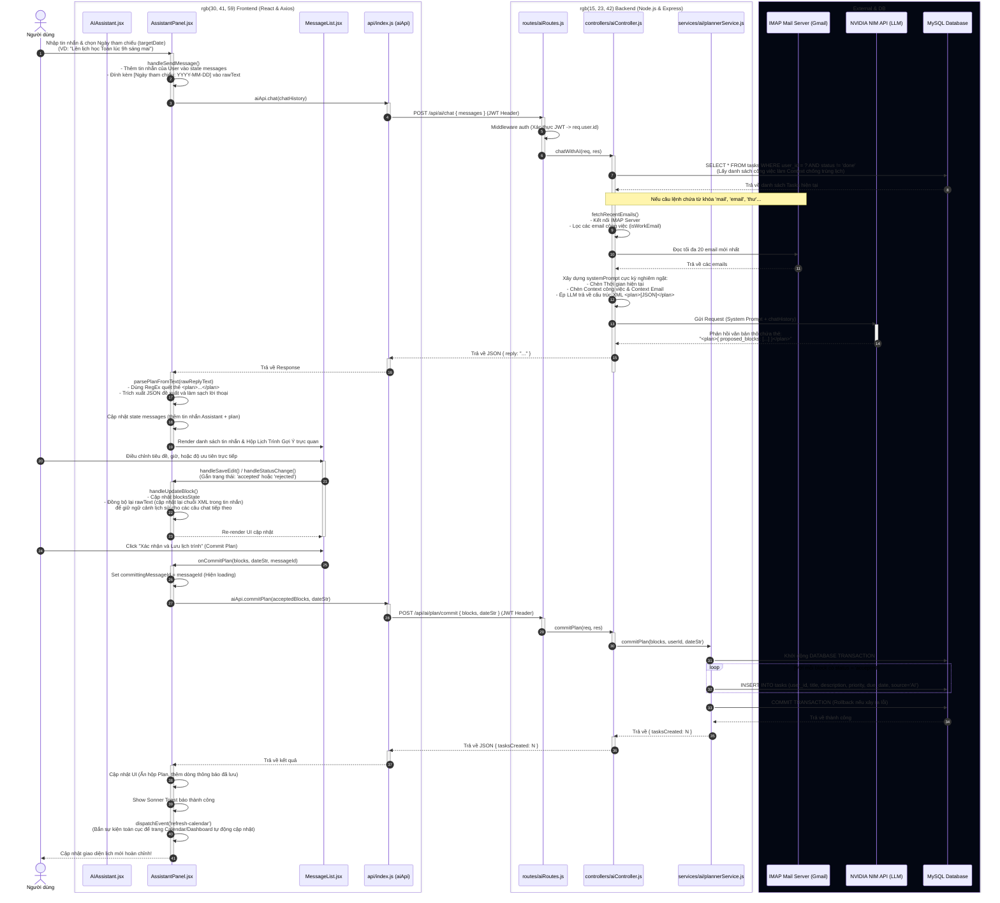
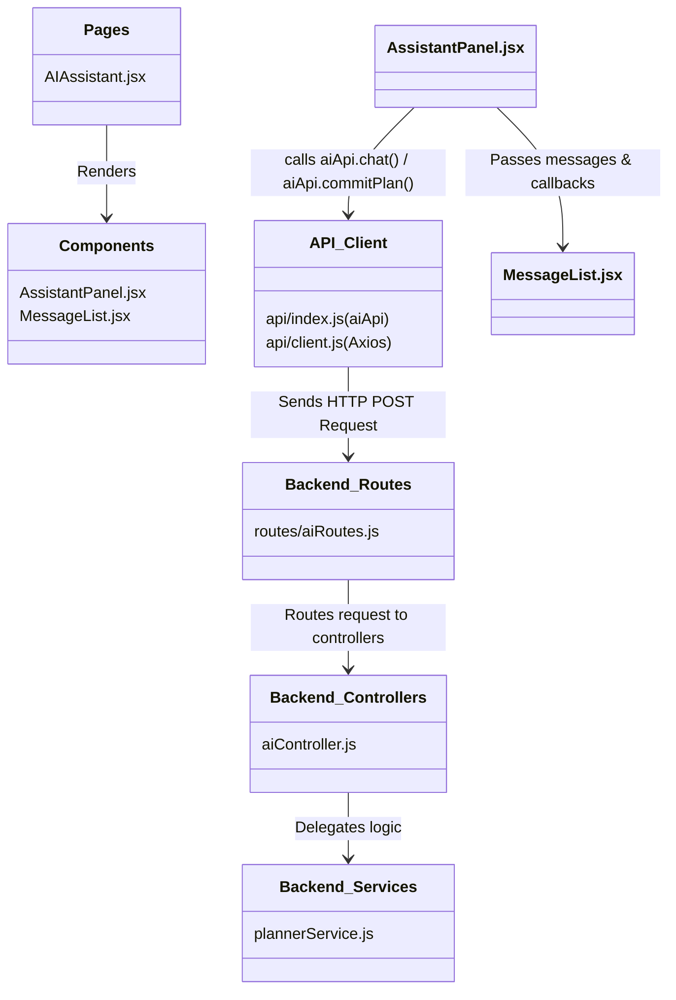
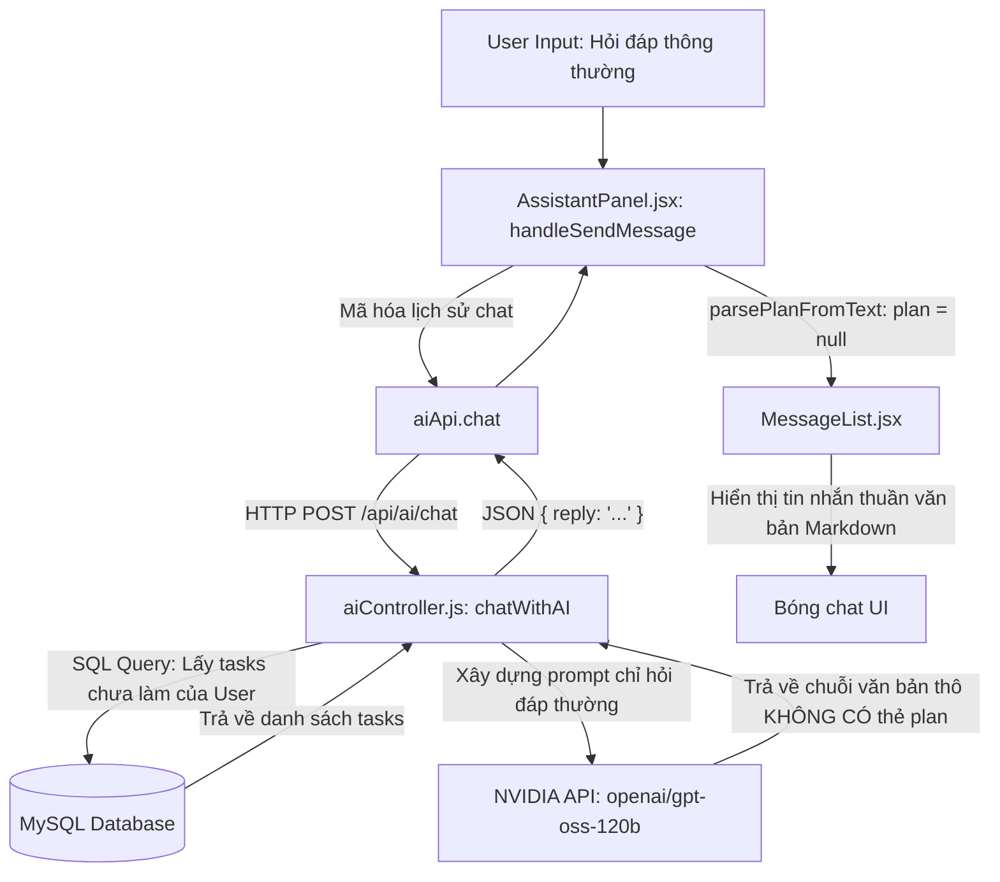
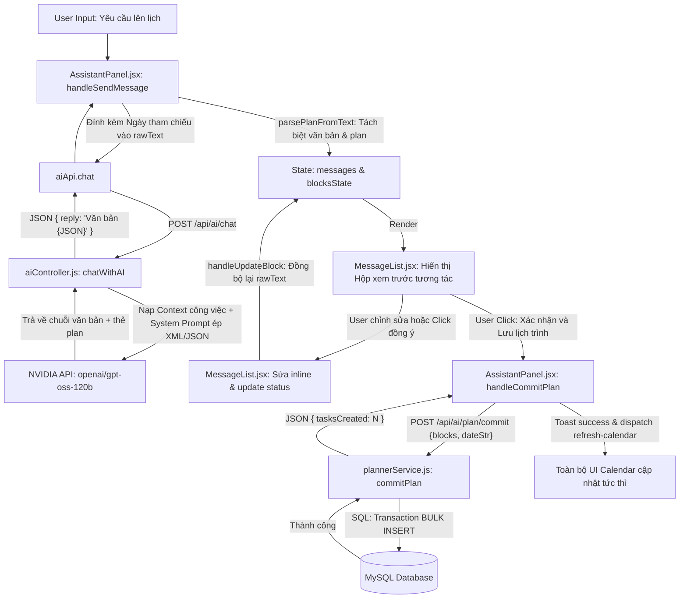
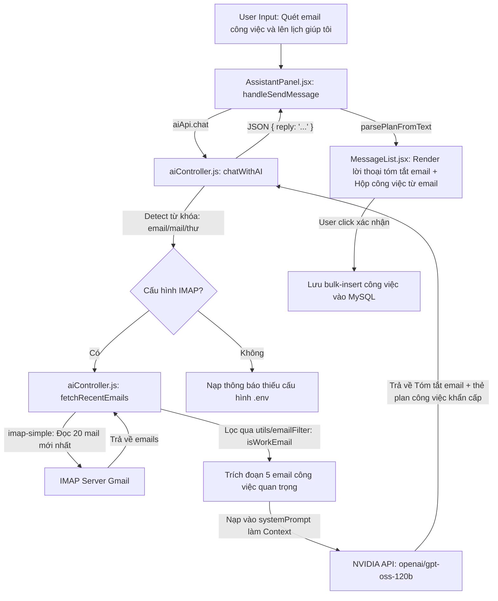
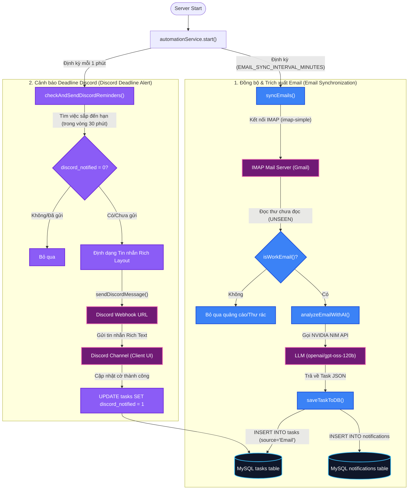

# 🤖 KIẾN TRÚC & HOẠT ĐỘNG CHỨC NĂNG CHAT VỚI AI (AI ASSISTANT PLANNER)

Tài liệu này cung cấp cái nhìn tổng quan, chi tiết và đầy đủ nhất về **Chức năng Chat với AI** trong ứng dụng **FocusFlow Personal Calendar**. Bạn sẽ hiểu rõ cách các thành phần từ **Frontend** đến **Backend** kết nối, tương tác và đồng bộ hóa với nhau thông qua mã nguồn thực tế.

---

## I. Sơ đồ Hoạt động Tổng quan (Sequence Diagram)

Dưới đây là sơ đồ Mermaid chi tiết mô tả luồng dữ liệu đi qua từng hàm, từng thành phần từ Giao diện người dùng (Frontend), API Client, Backend Controller, Service cho tới các dịch vụ bên ngoài (NVIDIA NIM API, IMAP Email) và Cơ sở dữ liệu (MySQL).



---

## II. Sơ đồ các Thành phần Mã nguồn (Code Components Diagram)

Sơ đồ dưới đây thể hiện mối quan hệ giữa các tệp tin trong thư mục dự án và cách chúng import lẫn nhau:



---

## III. Giải thích chi tiết từ Frontend (Giao diện hiển thị & Xử lý)

Màn hình Chat với AI được thiết kế cực kỳ hiện đại, tối ưu trải nghiệm người dùng với các chức năng tương tác trực tiếp.

### 1. Các thành phần hiển thị trên UI
* **Khung chat hội thoại**: Hiển thị bóng chat tin nhắn giữa Người dùng (phải) và Trợ lý ảo (trái). Sử dụng Markdown để hiển thị định dạng văn bản đẹp mắt, phân cấp đề mục rõ ràng.
* **Gợi ý nhanh (Suggestions)**: Khi lịch sử chat trống, hiển thị 4 nút gợi ý nhanh (ví dụ: *"Lên kế hoạch tập thể dục và đọc sách hôm nay"*) giúp người dùng dễ dàng bắt đầu.
* **Thanh chọn Ngày tham chiếu (Target Date)**: Cho phép người dùng chủ động chọn ngày để làm mốc thời gian tham chiếu. Điều này cực kỳ quan trọng vì nếu người dùng nói *"sắp xếp lịch cho ngày mai"*, AI cần biết ngày hiện tại là ngày nào để tính ra ngày mai chính xác.
* **Khung đề xuất lịch trình trực quan**: Khi AI phát hiện ra các kế hoạch công việc, một hộp giao diện xem trước (Preview) sẽ hiện ra dưới tin nhắn của AI. Hộp này chứa:
  * Danh sách các **Block công việc** kèm khung giờ, độ ưu tiên, lý do đề xuất.
  * Hộp chỉnh sửa nhanh (**Inline Editing Form**) xuất hiện khi click vào biểu tượng cây bút chì, cho phép đổi Tiêu đề, Khung giờ, và Độ ưu tiên ngay tại chỗ.
  * Các nút hành động: **Chấp nhận (Check)** và **Bác bỏ (X)** để chọn lọc công việc muốn thêm vào lịch.
  * Nút **"Chấp nhận tất cả"** để tích chọn toàn bộ.
  * Nút **"Xác nhận và Lưu lịch trình"** để gửi yêu cầu lưu chính thức.

### 2. Các hàm cốt lõi tại Frontend (`AssistantPanel.jsx` & `MessageList.jsx`)

#### a. `parsePlanFromText(rawReplyText)`
Khi nhận chuỗi văn bản thô phản hồi từ AI, hàm này sẽ chịu trách nhiệm phân tích cú pháp:
* Sử dụng biểu thức chính quy (RegEx): `const planRegex = /<plan>([\s\S]*?)<\/plan>/;`
* **Nếu khớp**: Tách phần chuỗi JSON nằm trong thẻ `<plan>` ra và dùng `JSON.parse` chuyển thành đối tượng Javascript.
* Loại bỏ phần XML khỏi văn bản thô để giữ lại lời thoại sạch sẽ hiển thị cho người dùng.
* Trả về đối tượng gồm: `{ text: "lời thoại sạch", plan: object, blocksState: object }`.

#### b. `handleSendMessage(textToSend)`
* Đọc chuỗi tin nhắn nhập vào của người dùng.
* Lấy ngày từ ô chọn **Ngày tham chiếu** và đính kèm vào tin nhắn dưới dạng ngữ cảnh ẩn: `[Ngày tham chiếu: YYYY-MM-DD] tin_nhắn_người_dùng`. Điều này giúp hệ thống gửi đầy đủ ngữ cảnh thời gian lên AI.
* Tạo lịch sử trò chuyện (`chatHistory`) chứa vai trò (`role`) và nội dung (`content`).
* Gọi hàm API: `const response = await aiApi.chat(chatHistory)`.
* Sau khi nhận phản hồi, gọi `parsePlanFromText()` để tách plan và cập nhật vào `messages` state.

#### c. `handleUpdateBlock(messageId, blockId, updates)`
* Khi người dùng tích chọn/hủy chọn, hoặc sửa nội dung block trên UI, hàm này sẽ cập nhật lại phần tử tương ứng trong `blocksState`.
* **Đồng bộ hóa lịch sử**: Hàm này sẽ tự động chuyển đổi `blocksState` mới thành chuỗi JSON và bọc lại vào thẻ `<plan>`, sau đó ghi đè lên `rawText` của tin nhắn đó. Điều này đảm bảo rằng nếu người dùng tiếp tục chat thêm (multi-turn), toàn bộ lịch sử gửi lên AI ở các lượt sau sẽ phản ánh đúng những gì người dùng vừa chỉnh sửa trên màn hình.

#### d. `handleCommitPlan(blocks, dateStr, messageId)`
* Lọc ra tất cả các blocks có trạng thái là `accepted`.
* Gọi API lưu chính thức: `await aiApi.commitPlan(acceptedBlocks, dateStr)`.
* Khi thành công, hiển thị thông báo **Sonner Toast** báo số lượng công việc được tạo mới.
* **Tự động đồng bộ ứng dụng**: Phát một sự kiện toàn cục: `window.dispatchEvent(new Event('refresh-calendar'));`. Trang Lịch biểu (Calendar) và Dashboard đang mở sẽ lắng nghe sự kiện này và tự động fetch lại dữ liệu mới nhất từ database mà không cần người dùng tải lại trang.

---

## IV. Giải thích chi tiết cách Backend hoạt động

Backend được xây dựng bằng Node.js, Express và kết nối cơ sở dữ liệu MySQL. Nó tiếp nhận các request từ Frontend, làm giàu ngữ cảnh thông tin (context enrichment) và điều phối các API.

### 1. Tầng định tuyến (`routes/aiRoutes.js`)
Định nghĩa 3 endpoint chính được bảo vệ bởi middleware xác thực `auth` (đảm bảo request phải đính kèm JSON Web Token hợp lệ):
* `POST /api/ai/chat` -> Gọi `aiController.chatWithAI`
* `POST /api/ai/plan` -> Gọi `aiController.generatePlan` (dùng để test/sinh plan độc lập)
* `POST /api/ai/plan/commit` -> Gọi `aiController.commitPlan`

### 2. Hàm Xử lý Chat `chatWithAI` (`aiController.js`)
Đây là trung tâm xử lý thông minh của backend:
* **Bước 1: Nhận diện người dùng**: Lấy `userId` từ `req.user.id` (do middleware `auth` giải mã từ token).
* **Bước 2: Nạp công việc hiện có (Context Enrichment)**: 
  * Truy vấn database: `SELECT * FROM tasks WHERE user_id = ? AND status != 'done'`.
  * Định dạng danh sách công việc thành chuỗi văn bản chi tiết làm ngữ cảnh (Context) gửi kèm prompt, giúp AI biết rõ lịch hiện tại của người dùng để tránh sắp xếp chồng chéo khung giờ.
* **Bước 3: Tích hợp đọc Email trực tiếp (IMAP Integration)**:
  * Phân tích câu hỏi của người dùng bằng cách chuyển về dạng viết thường: `const userQuery = lastMessage.content.toLowerCase();`.
  * Nếu người dùng nhắc tới các từ khóa liên quan đến email như `"mail", "email", "thư"`, hệ thống tự động gọi hàm `fetchRecentEmails()`.
  * Hàm `fetchRecentEmails()` kết nối với IMAP server (như Gmail) qua `imap-simple`, quét lấy 20 email mới nhất, chạy qua bộ lọc `isWorkEmail` để giữ lại tối đa 5 mail công việc quan trọng (Người gửi, tiêu đề, thời gian, snippet nội dung), sau đó chuyển thành văn bản đính kèm vào Prompt.
* **Bước 4: Xây dựng System Prompt cực kỳ nghiêm ngặt**:
  * Định nghĩa trợ lý FocusFlow thân thiện, chuyên nghiệp.
  * Cung cấp thời gian thực tế của hệ thống (`currentTimeStr`) để AI tự quy đổi các từ tương đối ("ngày mai", "thứ hai tới").
  * Cung cấp danh sách công việc hiện tại và email context.
  * **Ép cấu trúc XML bắt buộc**: Ra lệnh cho LLM nếu có đề xuất lịch trình, bắt buộc phải đặt đối tượng JSON chứa mảng `proposed_blocks` và trường `targetDate` vào bên trong thẻ `<plan>...</plan>` ở cuối câu trả lời.
* **Bước 5: Gọi NVIDIA NIM API**:
  * Gửi toàn bộ dữ liệu gồm `System Prompt` và `chatHistory` lên endpoint của NVIDIA NIM (`https://integrate.api.nvidia.com/v1/chat/completions`) sử dụng model `openai/gpt-oss-120b`.
  * Trả phản hồi chứa văn bản thô về cho Frontend.

### 3. Hàm Persist Kế hoạch `commitPlan` (`plannerService.js`)
Khi người dùng xác nhận áp dụng kế hoạch:
* Khởi động một **Database Transaction** (`connection.beginTransaction()`) để đảm bảo tính toàn vẹn dữ liệu (hoặc tất cả các công việc được thêm thành công, hoặc không có công việc nào được thêm nếu xảy ra lỗi giữa chừng).
* Lặp qua mảng các blocks, chỉ xử lý các block có trạng thái là `'accepted'`.
* Quy đổi thời gian: kết hợp `targetDate` và `startTime` của block để tạo ra trường `finalDueDate` đầy đủ định dạng ngày giờ (`YYYY-MM-DD HH:mm:ss`). Nếu không có giờ cụ thể, mặc định đặt là cuối ngày (`23:59:59`).
* Thực hiện câu lệnh SQL:
  ```sql
  INSERT INTO tasks (user_id, title, description, priority, due_date, source) 
  VALUES (?, ?, ?, ?, ?, 'AI')
  ```
  *(Trường `source` được đánh dấu là `'AI'` giúp dễ dàng lọc và thống kê các công việc do AI đề xuất sau này)*.
* Xác nhận Transaction (`connection.commit()`) và trả về tổng số công việc đã tạo.

---

## V. Cách các Thành phần Kết nối và Tương tác (Hoàn chỉnh)

Sự kết nối nhịp nhàng giữa Frontend và Backend được đảm bảo qua 3 cơ chế:

### 1. Xác thực và Bảo mật bằng JWT
Tất cả các API được gọi từ Frontend (`aiApi.chat`, `aiApi.commitPlan`) đều đi qua client Axios được cấu hình sẵn. Khi người dùng đăng nhập thành công, token JWT được lưu trong bộ nhớ. Axios Client sẽ tự động đính kèm token này vào header `Authorization: Bearer <token>` ở mỗi request. Khi Backend nhận được, middleware `auth` sẽ chặn lại để giải mã, xác định chính xác danh tính người dùng `userId`, bảo vệ dữ liệu lịch cá nhân an toàn tuyệt đối.

### 2. Sự phối hợp định dạng XML - JSON (Bí quyết trích xuất dữ liệu)
Thay vì sử dụng các thuật toán parsing văn bản thô không ổn định, ứng dụng sử dụng cấu trúc lai:
* **Hội thoại tự nhiên (Văn bản)**: Dành cho giao tiếp tự nhiên giữa người và máy.
* **Thẻ XML bọc JSON (`<plan>{...}</plan>`)**: Giúp LLM dễ dàng trả về cấu trúc chính xác mà không lo bị lẫn với văn bản mô tả. Frontend chỉ cần dùng regex bắt cặp thẻ và parse JSON một cách an toàn.

### 3. Đồng bộ hóa Real-time qua Sự kiện Toàn cục (Custom Events)
Ứng dụng sử dụng mô hình thiết kế hướng sự kiện (Event-Driven Architecture) ở Frontend. Khi kế hoạch được lưu xuống database thành công qua API, Component `AssistantPanel` không cần biết màn hình CalendarPage hay DashboardPage đang nằm ở đâu. Nó chỉ cần phát đi một tín hiệu:
```javascript
window.dispatchEvent(new Event('refresh-calendar'));
```
Các component hiển thị lịch và tiến độ công việc đã được đăng ký lắng nghe (`window.addEventListener('refresh-calendar', fetchMyData)`) sẽ ngay lập tức tự động load lại dữ liệu mới nhất. Điều này tạo cảm giác ứng dụng hoạt động liền mạch, tức thì và mượt mà.

---

## VI. Sơ đồ Luồng Chi tiết theo Từng Usecase Cụ thể (Input ➔ Output)

Để hiểu rõ cách dữ liệu được truyền tải, biến đổi qua từng hàm và kết quả trả ra giao diện như thế nào, dưới đây là chi tiết 3 Kịch bản sử dụng (Usecases) cốt lõi của chức năng Chat với AI.

---

### Usecase 1: Hỏi đáp thông thường (General Q&A - Retrieval)
* **Mô tả**: Người dùng đặt các câu hỏi truy vấn thông tin (ví dụ: lịch trình hôm nay, công việc chưa làm), không yêu cầu tạo mới lịch trình.
* **Sơ đồ luồng (Flowchart)**:



* **Mẫu dữ liệu Đầu vào & Đầu ra (Input ➔ Output)**:
  * **Input người dùng (UI)**: `"Hôm nay tôi có công việc nào gấp không?"`
  * **Dữ liệu trung gian gửi lên AI (Backend Enrichment)**:
    ```text
    [SYSTEM PROMPT - CONTEXT]:
    Thời gian hiện tại: 30/05/2026 09:15:00
    Công việc chưa hoàn thành của người dùng:
    - [CÔNG VIỆC] [Nguồn: AI] Học Tiếng Anh (Hạn: 30/05/2026 08:00, Ưu tiên: 2, Trạng thái: todo)
    - [CÔNG VIỆC] [Nguồn: Custom] Chuẩn bị slide báo cáo (Hạn: 30/05/2026 17:00, Ưu tiên: 1, Trạng thái: todo)
    ```
  * **Output trả về từ LLM (NVIDIA API)**:
    ```text
    Dựa trên danh sách công việc hôm nay, bạn có 1 công việc cực kỳ gấp độ ưu tiên **Cao (Mức 1)**:
    * **Chuẩn bị slide báo cáo** - Hạn chót vào lúc **17:00 chiều nay**.
    
    Ngoài ra, bạn có 1 việc đã quá hạn từ sáng nay:
    * **Học Tiếng Anh** (hạn 08:00). Bạn nên sắp xếp làm sớm nhé!
    ```
  * **Output hiển thị trên UI**: Tin nhắn dạng Markdown thông thường, không có nút hay hộp xem trước lịch biểu.

---

### Usecase 2: Tự động Đề xuất & Lập lịch trình mới (Scheduling & Plan Commitment)
* **Mô tả**: Người dùng yêu cầu sắp xếp thời gian biểu cho một ngày. Hệ thống tạo đề xuất, cho phép chỉnh sửa trực quan và lưu trực tiếp vào lịch.
* **Sơ đồ luồng (Flowchart)**:



* **Mẫu dữ liệu Đầu vào & Đầu ra (Input ➔ Output)**:
  * **Input người dùng (UI)**: `"Lên lịch giúp tôi học tiếng Anh lúc 8h sáng và dọn dẹp nhà lúc 10h sáng ngày mai"` *(Ngày tham chiếu đang chọn trên UI là `2026-05-30`)*.
  * **Đầu ra thô từ Backend (NVIDIA LLM Response)**:
    ```xml
    Tôi đã lên kế hoạch học tập và dọn dẹp nhà cửa vào buổi sáng ngày mai cho bạn. Khung giờ này hoàn toàn trống trên lịch biểu hiện tại của bạn.
    <plan>
    {
      "proposed_blocks": [
        {
          "title": "Học tiếng Anh",
          "type": "task",
          "startTime": "08:00",
          "endTime": "09:00",
          "priority": "2",
          "reason": "Khung giờ sáng sớm tỉnh táo, học ngôn ngữ đạt hiệu quả cao nhất"
        },
        {
          "title": "Dọn dẹp nhà cửa",
          "type": "task",
          "startTime": "10:00",
          "endTime": "11:00",
          "priority": "3",
          "reason": "Vận động nhẹ nhàng sau giờ học tập căng thẳng"
        }
      ],
      "targetDate": "2026-05-31"
    }
    </plan>
    ```
  * **Xử lý tại Frontend (Hàm `parsePlanFromText`)**:
    * **`text`** (Hiện trên chat bubble): *"Tôi đã lên kế hoạch học tập và dọn dẹp nhà cửa vào buổi sáng ngày mai..."*
    * **`plan`** (Đưa vào MessageList để render hộp xem trước):
      * Block 1: `Học tiếng Anh`, 08:00 - 09:00, Ưu tiên: 2, Trạng thái mặc định: `'pending'`.
      * Block 2: `Dọn dẹp nhà cửa`, 10:00 - 11:00, Ưu tiên: 3, Trạng thái mặc định: `'pending'`.
  * **Giai đoạn Lưu dữ liệu (Commit Plan)**:
    * Người dùng tích chọn đồng ý cả hai block (hoặc nhấn "Chấp nhận tất cả") và nhấn **"Xác nhận và Lưu lịch trình"**.
    * **Payload gửi lên `/api/ai/plan/commit`**:
      ```json
      {
        "dateStr": "2026-05-31",
        "blocks": [
          { "title": "Học tiếng Anh", "startTime": "08:00", "priority": "2", "reason": "...", "status": "accepted" },
          { "title": "Dọn dẹp nhà cửa", "startTime": "10:00", "priority": "3", "reason": "...", "status": "accepted" }
        ]
      }
      ```
    * **Kết quả lưu trong bảng `tasks` của DB**:
      1. Bản ghi 1: `title='Học tiếng Anh'`, `due_date='2026-05-31 08:00:00'`, `priority='2'`, `source='AI'`.
      2. Bản ghi 2: `title='Dọn dẹp nhà cửa'`, `due_date='2026-05-31 10:00:00'`, `priority='3'`, `source='AI'`.

---

### Usecase 3: Lập lịch dựa trên Email (Email-based Scheduling)
* **Mô tả**: Người dùng yêu cầu quét hộp thư để tóm tắt các email công việc khẩn cấp gần đây và tự động đề xuất lịch thực hiện các công việc đó.
* **Sơ đồ luồng (Flowchart)**:



* **Mẫu dữ liệu Đầu vào & Đầu ra (Input ➔ Output)**:
  * **Input người dùng (UI)**: `"Kiểm tra xem tôi có email công việc nào mới không và lên lịch giải quyết giúp tôi với"`
  * **Context giàu hóa đọc từ IMAP Server tại Backend**:
    ```text
    --- THƯ ĐIỆN TỬ CÔNG VIỆC (UID: 1084) ---
    Người gửi: supervisor@company.com
    Tiêu đề: Chuẩn bị tài liệu nghiệm thu dự án
    Thời gian nhận: 30/05/2026 07:30:15
    Nội dung trích đoạn: Chào bạn, đối tác vừa hẹn chúng ta họp nghiệm thu vào lúc 15:00 chiều mai ngày 31/05. Vui lòng hoàn thành hồ sơ dự án trước giờ họp nhé...
    ```
  * **Output trả về từ LLM (NVIDIA API)**:
    ```xml
    Tôi đã kiểm tra hộp thư của bạn và tìm thấy **1 email công việc khẩn cấp** mới nhận sáng nay từ **supervisor@company.com** với chủ đề **"Chuẩn bị tài liệu nghiệm thu dự án"**. 
    
    Đối tác hẹn họp nghiệm thu lúc 15:00 ngày mai (31/05/2026). Dưới đây là kế hoạch đề xuất giúp bạn hoàn thành tài liệu này sớm:
    <plan>
    {
      "proposed_blocks": [
        {
          "title": "Hoàn thành hồ sơ nghiệm thu dự án",
          "type": "task",
          "startTime": "09:00",
          "endTime": "11:30",
          "priority": "1",
          "reason": "Hoàn thành hồ sơ trước giờ họp nghiệm thu lúc 15:00"
        }
      ],
      "targetDate": "2026-05-31"
    }
    </plan>
    ```
  * **Output hiển thị trên UI**:
    * Tin nhắn hiển thị rõ ràng tóm tắt thư của Giám sát về buổi họp nghiệm thu lúc 15:00.
    * Xuất hiện hộp công việc gợi ý: *"Hoàn thành hồ sơ nghiệm thu dự án"* vào lúc 09:00 ngày 31/05/2026 với độ ưu tiên Cao (Mức 1) kèm nút bấm lưu nhanh.

---

## VII. Hệ thống Tự động hóa Chạy nền: Thu thập Email IMAP & Nhắc nhở Discord (Background Automation)

Bên cạnh giao diện Chat trực tiếp, ứng dụng sở hữu một hệ thống **Tự động hóa chạy nền (Background Automation System)** tự vận hành liên tục tại file [automationService.js](file:///Users/mong/Documents/FrontEnd/personal-calendar/backend/src/services/automationService.js). Hệ thống này giúp thu thập các yêu cầu công việc tự động từ hòm thư điện tử và cảnh báo deadline khẩn cấp trực tiếp về Discord của người dùng.

---

### 1. Sơ đồ Kiến trúc & Tương tác Tổng quan (Automation Architecture)

Dưới đây là sơ đồ Mermaid biểu diễn sự vận hành song song, khép kín của hai bộ quét tự động (Background Workers):



---

### 2. Giải thích chi tiết các Thành phần & Hàm cốt lõi (Code Analysis)

Hệ thống tự động hóa chạy nền hoạt động hoàn toàn độc lập với luồng HTTP request thông thường. Nó bắt đầu chạy ngay khi ứng dụng Node.js khởi động thông qua hàm khởi động tập trung:

#### a. Hàm điều phối khởi động: `start()`
* **Nhiệm vụ**: Đọc cấu hình môi trường từ tệp `.env` để quyết định kích hoạt dịch vụ:
  * Kiểm tra cờ `ENABLE_AUTOMATION === 'true'`.
  * Nếu có cấu hình `IMAP_USER` và `IMAP_PASSWORD`, thiết lập vòng lặp định kỳ chạy hàm quét email `syncEmails()`.
  * Nếu có cấu hình `DISCORD_WEBHOOK_URL`, thiết lập vòng lặp định kỳ mỗi **1 phút** chạy hàm kiểm tra nhắc việc `checkAndSendDiscordReminders()`.
  * Thiết lập vòng lặp định kỳ mỗi **1 tiếng** chạy hàm dọn dẹp dữ liệu cũ `cleanCompletedTasks()`.

#### b. Thành phần 1: Bộ thu thập & Trích xuất Email bằng AI (Email Synchronization Worker)
Đây là bộ phận giúp số hóa hòm thư email của người dùng thành các công việc cụ thể trên lịch trình:
* **Hàm `syncEmails()`**:
  * Sử dụng thư viện `imap-simple` để mở kết nối bảo mật (SSL/TLS) đến hộp thư Gmail của người dùng.
  * Truy vấn tất cả các email có nhãn chưa đọc (`'UNSEEN'`). Sau khi quét, hệ thống tự động đánh dấu đã đọc (`markSeen: true`) để tránh xử lý trùng ở các chu kỳ sau.
  * Lấy ra tiêu đề, người gửi và nội dung email thô bằng bộ phân tách `mailparser`.
* **Hàm lọc `isWorkEmail(subject, from, text)` (độc lập tại `utils/emailFilter.js`)**:
  * Rà soát loại bỏ các email rác quảng cáo (`promo`, `newsletter`), thông báo bảo mật hệ thống (`security`, `verification`, `otp`), các email tự động gửi từ hệ thống (`no-reply`).
  * Chỉ giữ lại các email có chứa các từ khóa công việc khẩn cấp (như `yêu cầu`, `lịch họp`, `báo cáo`, `deadline`, `khẩn cấp`...).
* **Hàm phân tích `analyzeEmailWithAI(subject, text)`**:
  * Chuyển tiếp nội dung email công việc thô đến NVIDIA NIM API (`openai/gpt-oss-120b`).
  * Sử dụng một System Prompt chuyên dụng ép mô hình AI đọc hiểu nội dung email, tự nhận diện thời hạn khẩn cấp (due date) và trích xuất thành đúng **1 cục JSON cấu trúc chuẩn** chứa: `title`, `description`, `due_date`, và `priority`.
* **Hàm lưu trữ `saveTaskToDB(aiData, emailUid, fromEmail)`**:
  * Tự động ánh xạ email sang tài khoản người dùng tương ứng trong hệ thống MySQL.
  * Thực hiện câu lệnh INSERT lưu công việc vào bảng `tasks` với trường `source` được đặt là `'Email'` và lưu `email_uid` để làm khóa chống trùng lặp dữ liệu tuyệt đối (nếu quét lại trùng).
  * Đồng thời, INSERT một dòng thông báo đẹp mắt vào bảng `notifications` để hiển thị trên giao diện của người dùng (*Ví dụ: "Công việc 'Hoàn thiện hồ sơ nghiệm thu' vừa được tự động trích xuất từ email của bạn"*).

#### c. Thành phần 2: Bộ nhắc nhở công việc qua Discord Webhook (Discord Deadline Alert Worker)
Thành phần này chịu trách nhiệm cảnh báo trực tiếp về kênh giao tiếp Discord giúp người dùng không bao giờ lỡ hạn chót:
* **Hàm `checkAndSendDiscordReminders()`**:
  * Chạy liên tục mỗi phút một lần.
  * **Cơ chế quét an toàn (Timezone-safe & Restart-proof)**: Hệ thống tính toán thời gian hiện tại dựa trên múi giờ địa phương Việt Nam (`Asia/Ho_Chi_Minh`) dưới dạng chuỗi định dạng MySQL `YYYY-MM-DD HH:mm:ss`.
  * Truy vấn các công việc đáp ứng đồng thời 4 tiêu chuẩn:
    1. Chưa hoàn thành (`status != 'done'`).
    2. Có thời hạn hoàn thành cụ thể (`due_date IS NOT NULL`).
    3. Chưa được thông báo qua Discord trước đó (`discord_notified = 0`).
    4. Thời hạn hoàn thành nằm trong khoảng quét: Từ **10 phút trước** (`tenMinutesAgo`) đến **30 phút tiếp theo** (`in30Minutes`). Khoảng quét lùi 10 phút là một cơ chế thiết kế phòng thủ xuất sắc, giúp quét bù đầy đủ các công việc cần nhắc nhở nếu máy chủ bị restart đột ngột ngay thời điểm cận kề deadline.
* **Hàm định dạng & Gửi thông tin `sendDiscordMessage(text)`**:
  * Chuyển đổi các thông số thô thành giao diện thông báo chuyên nghiệp (Rich Layout) bằng cách sử dụng các Emojis sinh động: độ ưu tiên biểu diễn bằng icon màu (`🔴 Cao`, `🟡 Trung bình`, `🟢 Thấp`), nguồn công việc rõ ràng (`📧 Email`, `👤 Tự tạo`).
  * Thực hiện cuộc gọi API POST sử dụng `fetch` gửi tin nhắn thô dạng Markdown Rich Text đến đường dẫn Webhook cấu hình (`process.env.DISCORD_WEBHOOK_URL`).
  * Khi gửi thành công, thực thi câu lệnh SQL cập nhật trạng thái: `UPDATE tasks SET discord_notified = 1 WHERE id = ?`. Trạng thái này đảm bảo mỗi công việc chỉ gửi thông báo nhắc nhở duy nhất một lần về Discord.

---

### 3. Cơ chế tương tác liên kết trong Hệ thống lớn (System Interaction)

Hệ thống Tự động hóa Chạy nền được thiết kế phối hợp nhịp nhàng với cơ sở dữ liệu và các thành phần khác, tạo thành một **Chu trình tự vận hành khép kín (Closed-loop Automation)**:

```
[ Gmail Server ] ➔ (Quét IMAP) ➔ [ Automation: syncEmails() ]
                                      ⬇
                                 (AI Extraction)
                                      ⬇
[ Discord Channel ] ⬅ (Webhook Alert) ⬅ [ MySQL DB: tasks ] 
```

1. **Từ Hòm thư đến Cơ sở dữ liệu**:
   Khi một email giao việc khẩn cấp mới được gửi đến hòm thư Gmail của bạn, trong vòng 5 phút, `syncEmails()` sẽ tự động phát hiện, gửi lên NVIDIA NIM API phân tích ngữ cảnh để tạo ra một công việc hoàn chỉnh có hạn chót diễn ra vào chiều mai trong bảng `tasks`.
2. **Từ Cơ sở dữ liệu đến Giao diện & Thiết bị của bạn**:
   * Khi người dùng truy cập ứng dụng Web, màn hình Calendar và Dashboard sẽ lập tức hiển thị công việc nguồn `'Email'` này, đồng thời mục Notifications (Bảng chuông thông báo) sẽ hiện nhãn đỏ báo công việc mới được đồng bộ.
   * Khi thời gian trôi dần đến cách hạn chót đúng 30 phút, bộ quét `checkAndSendDiscordReminders()` sẽ ngay lập tức bắt được công việc này trong DB, định dạng thành tin nhắn Rich Layout có các icon độ ưu tiên nổi bật và đẩy thông báo tức thì về điện thoại/máy tính của bạn qua ứng dụng Discord.

*Nhờ cơ chế này, FocusFlow hoạt động như một thư ký số thực thụ: Tự động ghi nhận công việc từ Email ➔ Sắp xếp thời gian biểu thông minh qua AI Chat ➔ Nhắc nhở tức thì qua Discord khi đến hạn.*

---

## VIII. Bản đồ Chi tiết Biến số, Luồng Dữ liệu & Tham số (Variable Map & Data Flow Details)

Nhằm giúp việc lập trình và bảo trì dễ dàng hơn, dưới đây là bảng đặc tả chi tiết về **Đầu vào (Inputs), Biến nội bộ (Internal Variables), và Đầu ra (Outputs)** của các hàm cốt lõi cấu thành nên hệ thống.

---

### 1. Phân hệ Frontend (Giao diện React)

#### Component: [AssistantPanel.jsx](file:///Users/mong/Documents/FrontEnd/personal-calendar/frontend/src/components/assistant/AssistantPanel.jsx)

| Tên Hàm | Tham số Đầu vào (Inputs) & Nguồn lấy | Các Biến nội bộ (Internal Variables) & Ý nghĩa | Đầu ra (Outputs) & Nơi nhận |
| :--- | :--- | :--- | :--- |
| **`parsePlanFromText`** | **`rawReplyText`** (String): Chuỗi phản hồi văn bản thô của AI nhận về từ API Axios của Backend. | * `planRegex` (RegExp): Biểu thức chính quy quét tìm cặp thẻ XML `<plan>...</plan>`. <br> * `match` (Array/Null): Kết quả so khớp Regex để bóc tách phần nội dung bên trong thẻ. <br> * `jsonStr` (String): Chuỗi ký tự JSON kế hoạch nằm giữa hai thẻ được loại bỏ khoảng trắng dư thừa. <br> * `plan` (Object): Đối tượng Javascript sau khi phân tích chuỗi JSON. <br> * `blocksState` (Array): Mảng các block công việc đề xuất, được gán thêm thuộc tính `id` ngẫu nhiên và `status` mặc định là `'pending'` phục vụ giao diện check/uncheck. | **Object `{ text, plan, blocksState }`**: <br> * `text`: Lời thoại đã lọc sạch XML hiển thị trên bóng chat. <br> * `plan`/`blocksState`: Dữ liệu kế hoạch phục vụ việc render hộp Preview và quản lý trạng thái phê duyệt. |
| **`handleSendMessage`** | **`textToSend`** (String/Null): Nội dung tin nhắn người dùng click từ suggest nhanh (nếu có). | * `inputText` (String State): Nội dung tin nhắn người dùng gõ từ ô nhập liệu textarea. <br> * `targetDate` (String State): Ngày tham chiếu chọn từ bộ Date Picker (`input[type="date"]`). <br> * `contextDateText` (String): Chuỗi văn bản thô ghép giữa Ngày tham chiếu ẩn và tin nhắn người dùng: `[Ngày tham chiếu: YYYY-MM-DD] tin_nhắn`. <br> * `newUserMessage` (Object): Bản ghi tin nhắn người dùng chứa cả `text` sạch (hiển thị UI) và `rawText` (chứa ngữ cảnh ngày để gửi lên AI). <br> * `chatHistory` (Array): Mảng lịch sử trò chuyện đã được tối giản chỉ giữ `{ role, content }` để gửi lên API. <br> * `response` (Object): Dữ liệu trả về từ `aiApi.chat`. | **Không trả về** (Cập nhật trực tiếp `messages` state và kích hoạt `parsePlanFromText` để cập nhật tin nhắn của AI Assistant kèm theo hộp đề xuất nếu có). |
| **`handleUpdateBlock`** | * **`messageId`** (String): ID tin nhắn Assistant chứa đề xuất lịch. <br> * **`blockId`** (String): ID của block công việc cần chỉnh sửa. <br> * **`updates`** (Object): Các trường thông tin thay đổi (`title`, `startTime`, `priority`, `status`). | * `updatedBlocks` (Array): Mảng blocks sau khi áp dụng thay đổi. <br> * `updatedPlan` (Object): Lập lại cấu trúc JSON kế hoạch mới để đồng bộ. <br> * `planXml` (String): Chuỗi XML chứa JSON mới vừa lập. <br> * `cleanText` (String): Văn bản lời thoại đã lọc sạch XML cũ. <br> * `newRawText` (String): Lời thoại sạch kết hợp với chuỗi XML mới. | **Không trả về** (Ghi đè trực tiếp `blocksState` và `rawText` mới vào tin nhắn tương ứng trong `messages` state nhằm đồng bộ ngữ cảnh gửi lên AI cho lượt chat tiếp theo). |
| **`handleCommitPlan`** | * **`blocks`** (Array): Danh sách các blocks đề xuất hiện tại. <br> * **`dateStr`** (String): Ngày diễn ra kế hoạch (`YYYY-MM-DD`). <br> * **`messageId`** (String): ID tin nhắn chứa kế hoạch để cập nhật trạng thái UI. | * `acceptedBlocks` (Array): Danh sách blocks có `status === 'accepted'` (người dùng đã duyệt). <br> * `results` (Object): Kết quả trả về từ `aiApi.commitPlan` gồm `{ eventsCreated, tasksCreated }`. | **Không trả về** (Kích hoạt `toast.success`, ẩn hộp Preview bằng cách đặt `plan = null` và phát đi sự kiện `'refresh-calendar'` để Calendar Page tự động tải lại dữ liệu). |

---

### 2. Phân hệ Backend Controller & Service (Node.js & MySQL)

#### Tệp tin: [aiController.js](file:///Users/mong/Documents/FrontEnd/personal-calendar/backend/src/controllers/aiController.js)

| Tên Hàm | Tham số Đầu vào (Inputs) & Nguồn lấy | Các Biến nội bộ (Internal Variables) & Ý nghĩa | Đầu ra (Outputs) & Nơi nhận |
| :--- | :--- | :--- | :--- |
| **`chatWithAI`** | **`req`** (Express Request): Chứa `req.body.messages` (lịch sử chat từ Frontend) và `req.user.id` (ID người dùng giải mã từ JWT). | * `userId` (Integer): ID của người dùng thực hiện chat. <br> * `tasks` (Array): Mảng danh sách công việc chưa làm của user truy vấn từ database. <br> * `formattedTasks` (String): Chuỗi văn bản thô tóm tắt các tasks chưa làm làm context gửi LLM. <br> * `currentTimeStr` (String): Thời gian hiện tại dạng Tiếng Việt dùng làm mốc thời gian thực. <br> * `userQuery` (String): Tin nhắn cuối của người dùng dạng viết thường để quét từ khóa. <br> * `needsEmailContext` (Boolean): Cờ xác định user có hỏi về email không. <br> * `emailInboxContext` (String): Tóm tắt nội dung các email công việc quét từ IMAP. <br> * `systemPrompt` (Object): Chỉ thị cực kỳ nghiêm ngặt định hướng tính cách, ngữ cảnh lịch biểu, email và định dạng `<plan>` XML bắt buộc. <br> * `apiMessages` (Array): Payload hoàn chỉnh gửi lên LLM. <br> * `assistantReply` (String): Nội dung phản hồi văn bản thô nhận về từ NVIDIA API. | **HTTP Response (JSON)** gửi về Frontend: <br> `{ reply: assistantReply }`. <br> Trả về mã lỗi `500` nếu API Key bị thiếu hoặc NVIDIA API lỗi. |
| **`fetchRecentEmails`** | **Không có** (Đọc thông tin cấu hình trực tiếp từ `process.env`). | * `config` (Object): Tham số kết nối IMAP (`user`, `password`, `host`, `port`, `tls`). <br> * `connection` (IMAP Connection): Kết nối IMAP đang mở. <br> * `messages` (Array): Danh sách 20 mail mới nhất quét từ hộp thư. <br> * `workEmails` (Array): Mảng chứa tối đa 5 mail công việc sau lọc. <br> * `formatted` (String): Chuỗi văn bản định dạng tóm tắt emails (tiêu đề, người gửi, snippet) để chuyển cho `chatWithAI`. | **String**: Chuỗi văn bản tóm tắt các email công việc khẩn cấp gần đây hoặc thông báo lỗi nếu không kết nối được IMAP. |

#### Tệp tin: [plannerService.js](file:///Users/mong/Documents/FrontEnd/personal-calendar/backend/src/services/ai/plannerService.js)

| Tên Hàm | Tham số Đầu vào (Inputs) & Nguồn lấy | Các Biến nội bộ (Internal Variables) & Ý nghĩa | Đầu ra (Outputs) & Nơi nhận |
| :--- | :--- | :--- | :--- |
| **`commitPlan`** | * **`blocks`** (Array): Danh sách công việc được truyền từ controller. <br> * **`userId`** (Integer): ID người dùng. <br> * **`targetDate`** (String): Ngày áp dụng lịch (`YYYY-MM-DD`). | * `results` (Object): Đối tượng theo dõi số lượng công việc được chèn `{ tasksCreated: 0 }`. <br> * `connection` (MySQL Pool Connection): Kết nối cơ sở dữ liệu dùng để chạy transaction. <br> * `block` (Object): Phần tử lặp trong mảng blocks. <br> * `finalDueDate` (String/Null): Thời hạn công việc đầy đủ định dạng MySQL `YYYY-MM-DD HH:mm:ss`, kết hợp từ `targetDate` và `startTime` của block. Mặc định là `23:59:59` nếu không có giờ bắt đầu. | **Object `{ tasksCreated: N }`** trả về cho Controller để phản hồi tiếp về Client. Chạy trong một Transaction an toàn (Tự động Rollback nếu có 1 bản ghi lỗi). |

---

### 3. Phân hệ Tự động hóa chạy nền (Background Automation)

#### Tệp tin: [automationService.js](file:///Users/mong/Documents/FrontEnd/personal-calendar/backend/src/services/automationService.js)

| Tên Hàm | Tham số Đầu vào (Inputs) & Nguồn lấy | Các Biến nội bộ (Internal Variables) & Ý nghĩa | Đầu ra (Outputs) & Nơi nhận |
| :--- | :--- | :--- | :--- |
| **`syncEmails`** | **Không có** (Chạy nền định kỳ qua `setInterval`). | * `config` (Object): Cấu hình IMAP. <br> * `connection` (IMAP): Kết nối hòm thư. <br> * `messages` (Array): Danh sách thư chưa đọc (`UNSEEN`). <br> * `emailUid` (String): UID định danh duy nhất của thư dạng `email-<uid>`. <br> * `parsed` (Object): Email sau khi được parse bằng `mailparser` (tiêu đề, người gửi, nội dung). <br> * `aiData` (Object): JSON chứa công việc do NVIDIA AI tự động trích xuất (`title`, `description`, `due_date`, `priority`). | **Không trả về** (Tự động chuyển tiếp `aiData` đến hàm `saveTaskToDB` để lưu trữ và tạo thông báo trong database). |
| **`checkAndSendDiscordReminders`** | **Không có** (Chạy nền định kỳ mỗi 1 phút qua `setInterval`). | * `now` (Date): Đối tượng thời gian hiện tại. <br> * `tenMinutesAgo` / `in30Minutes` (Date): Khoảng thời gian quét deadline sát hạn. <br> * `tenMinutesAgoStr` / `in30MinutesStr` (String): Thời gian quét định dạng chuỗi MySQL `YYYY-MM-DD HH:mm:ss` cục bộ Việt Nam. <br> * `tasksToNotify` (Array): Danh sách các công việc thỏa mãn điều kiện sắp đến hạn và chưa được thông báo (`discord_notified = 0`) truy vấn từ DB. <br> * `message` (String): Tin nhắn Rich Layout định dạng sẵn Markdown. <br> * `success` (Boolean): Trạng thái gửi tin nhắn về Discord Webhook API. | **Không trả về** (Nếu `success === true`, thực thi câu lệnh UPDATE đặt `discord_notified = 1` cho công việc tương ứng trong DB để đánh dấu tránh gửi trùng lặp). |
| **`sendDiscordMessage`** | **`text`** (String): Nội dung tin nhắn nhắc việc được định dạng sẵn Markdown. | * `webhookUrl` (String): URL Webhook của Discord lấy từ biến môi trường `process.env.DISCORD_WEBHOOK_URL`. <br> * `response` (Fetch Response): Trạng thái phản hồi từ API của Discord. | **Boolean (`true`/`false`)**: Trạng thái gửi tin nhắn thành công hoặc thất bại về máy chủ của Discord. |

---
*Tài liệu này được biên soạn đầy đủ để phục vụ cho việc đọc hiểu, bảo trì và phát triển nâng cao tính năng AI Assistant Planner trong hệ thống.*


